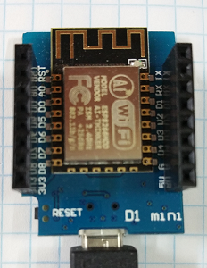

# D1 mini - Demo: Klasse f&uuml;r digitalen Ausgang
Sketch: D1_oop01_Dout1.ino, Version 2017-12-03   
[English Version](./README.md "English Version")   

Demo zu den Methoden der Klasse Dout:   
* Blaue LED 2 sec einschalten, dann 2 sec ausschalten.
* Umschalten der LED alle 0,5s und alle 0,1s Anzeige der Dauer, wie lange die LED bereits diesen Zustand hat (mit 115200 Baud).   

## Hardware
* WeMos D1 mini



&nbsp;

**Beispiel f&uuml;r die Ausgabe auf der seriellen Schnittstelle:**
```
Blue LED on
Blue LED off
*T* 0 100 200 300 400 *T* 0 100 200 300 400 
*T* 0 100 200 300 400 *T* 0 100 200 301 401 
*T* 0 100 200 300 400 *T* 0 100 200 300 401 
*T* 0 100 200 300 400 *T* 0 100 200 300 400 
*T* 0 101 201 301 401 *T* 0 100 200 300 400
```

## Klassendiagramm Dout
| Klasse Dout                        |     |
| ---------------------------------- | --- |
| ~ Dout()            | Konstruktor mit Vorgabwerten (Digitaler Ausgangspin D4, nicht invertiert) |
| ~ Dout(int num)     | Konstruktor mit angegebener Pinnummer (=GPIO), nicht invertiert |
| ~ Dout(bool invert) | Konstruktor mit Vorgabe-Pinnummer (D4) und Wahl der Inverter-Typs |
| ~ Dout(int num, bool invert) | Konstruktor mit Wahl von Ausgangspin und Inverter-Typ  |
| ~ void setup(int num, bool invert) | Setup Output Pin und Eigenschaften |
| === *Setter-, Getter- und Arbeitsmethoden* === |     |
| + void set(int val)           | Setze den Ausgangspin physikalisch:  0=0V, 1=3V3 |
| + void on(void)               | Setze den Ausgangspin auf logisch ein (Ausgangswert 0|1 abh&auml;ngig von invert_) |
| + void off(void)              | Setze den Ausgangspin auf logisch aus (Ausgangswert 0|1 abh&auml;ngig von invert_) |
| + void toggle()               | Wechsle den Ausgangswert on <--> off bzw. 1 <--> 0  |
| + unsigned long getDuration() | Anzahl der Millisekunden seit der letzten Pegel&auml;nderung |
  
&nbsp;

|  *Eigenschaften*            |                                           |
| --------------------------- | ----------------------------------------- |
| ~ int  doutNum_             | Pinnummer (Vorgabe D4 = GPIO2)            |
| ~ bool invert_              | Wenn false: 0=0V 1=3V3 (positive Logik), wenn true: 0=3V3 1=0V (negative Logik) |
| ~ int  val_                 | Physikalischer Ausgangswert (positive Logik): 0=0V, 1=3V3  |
| ~ unsigned long lastMilli_  | Uhrzeit in ms (Wert der Funktion millis()) |
