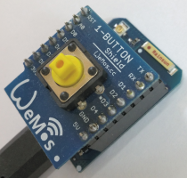

# D1_oop01_DIO1 
This example shows how to use the classes Din and Led.

The status of a button at D3 (=DGPIO0) is shown on blue LED (D4=GPIO2).
+ If the button is pressed, the input is zero (0) and this causes the led to light up.
+ If the button is pressed or released, a message is sent to Serial (9600Bd).

## Hardware
* WeMos D1 mini
* 1-Button Shield

## Class diagrams   

| class Din    |   
| ---------    |   
| - void setup(int num)   - int  din_num   - int  din_old   - int  last_edge  |   
| + Din()   + Din(int num)   + int  get(void)   + bool isPressed(void)   + bool is_falling_edge(void)   + bool is_rising_edge(void) |   
   
| class Led |
| --------- |
| - void setup(int num)   - int  led_num |
| + Led()   + Led(int num)   + void set(int on_0)   + void on(void)   +  void off(void) |
