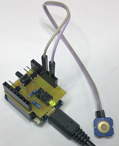

# D1_oop01_DIO2 
This example shows how to use more than one object of classes Din and Dout (2x Din, 3x Dout).

+ When no button is pressed, the red LED (D8) lights up for 1.5s, then the green LED (D7) lights up for 0.5s and so on.
+ If button D3 is pressed, the blue LED lights up.
+ If button D5 is pressed, both LEDs (red and green) turn on. 
  If D7-D8 is a 3-pin-DUO-LED, the light is yellow.

## Hardware
* WeMos D1 mini
* D1_IO_Shield1 (self-designed) 2x LEDs at D7 (green), D8 (red), 1x Button at D5

## Class diagrams
| class Din |
| --------- |
| - void setup(int num)   - int  din_num   - int  din_old   - int  last_edge  |
| + Din()   + Din(int num)   + int  get(void)   + bool isPressed(void)   + bool is_falling_edge(void)   + bool is_rising_edge(void) |

| class Dout |
| ---------- |
| - int  dout_num   - bool invert_ |
| - void setup(int num, bool invert) |
| + Dout()   + Dout(int num)   + Dout(int num, bool invert)   + void set(int val)   + void on(void)   + void off(void) |