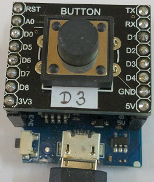

# D1 mini - Demo: Anwendungsbeispiel f&uuml;r die Klasse Din (digitale Eingabe, Version 2)
Sketch: D1_oop01_Din1.ino, Version 2017-12-07   
[English Version](./README.md "English Version")   

Zeige die Verwendung der Methoden der Klasse Din:   
* Anzeige der Dauer dieses Signalzustands = Zeit seit der letzten Flanke in Sekunden
* Einlesen des Tastenstatus (0 oder 1) und Anzeige durch die blaue LED (Taste gedr&uuml;ckt -> LED leuchtet)
* Pr&uuml;fen auf fallende oder steigende Flanke; Ausgabe einer Nachricht, wenn wahr
* Schreiben eines P auf die serielle Schnittstelle, wenn die Taste gedr&uuml;ckt ist    

Zykluszeit ist 0,2 Sekunden, Ergebnisse werden an die serielle Schnittstelle gesendet (115200 Baud).

## Hardware
* WeMos D1 mini
* Button shield (D3) oder Draht von D3 zu GND



&nbsp;

**Beispiel f&uuml;r die serielle Ausgabe:**
```
Press button D3!
0.01s 0.21s 0.41s 0.61s 0.81s 1.01s 1.21s 1.41s 1.61s 1.81s 
2.01s 2.21s 2.41s 2.61s 2.81s 3.01s 3.21s 
Last Duration: 3214 ms ---> Button pressed!
P 0.20s P 0.40s P 0.60s P 0.80s P 1.00s P 1.20s P 1.40s P 1.60s P 1.80s P 2.00s 
P 2.20s P 2.40s P 2.60s P 2.80s P 3.00s P 3.20s 
Last Duration: 3203 ms ---> Button released!
0.20s 0.40s 0.60s 0.80s 1.00s 1.20s 1.40s 1.60s 1.80s 
Last Duration: 1801 ms ---> Button pressed!
P 0.20s P 0.40s 
Last Duration: 401 ms ---> Button released!
0.20s 0.40s 0.60s 0.80s 1.00s 1.20s 1.40s 
Last Duration: 1401 ms ---> Button pressed!
P 0.20s P 0.40s 
Last Duration: 401 ms ---> Button released!
0.20s 0.40s 0.60s 0.80s 1.00s 1.20s 1.40s 1.60s 1.80s 2.00s 
2.20s 2.40s 2.60s 2.80s 3.00s 3.20s 3.40s 3.60s 3.80s 4.00s
```


## Klassendiagramm Din
| Klasse Din                     |                                               |
| ----------------------------- | --------------------------------------------- |
| + Din()                       | Vorgabe Konstruktor, setzt Pin auf D3, ruft setup() auf |
| + Din(int num)                | Setzen des Input Pins, Aufruf von setup()               |
| ~ void setup(int num)         | Setzt die Eigenschaften: input mode, lastMlli_, ...  |
| ===== *setter, getter, working methods* ===== |                               |
| + int  get(void)              | Liest Eingabepin ein, pr&uuml;ft auf Flanke, R&uuml;ckgabe val |
| + bool isPressed(void)        | Ruft get() auf, gibt true (= Taste gedr&uuml;ckt = 0V) oder false (3V3) zur&uuml;ck |
| + bool isFallingEdge(void)    | Ruft get() auf, gibt true zur&uuml;ck, wenn Taste gedr&uuml;ckt wurde  |
| + bool isRisingEdge(void)     | Ruft get() auf, gibt true zur&uuml;ck, wenn Taste losgelassen wurde |
| + int  getLast(void)          | Gibt letzten Eingabewert zur&uuml;ck ohne neuerliches Einlesen |
| + unsigned long getDuration() | Gibt die Dauer des aktuellen Pinzustands in msec zur&uuml;ck (seit letzter Flanke) |
| + unsigned long getLastDuration() | Gibt die Dauer des vorherigen Pinzustands in msec zur&uuml;ck (ohne Pinabfrage) |

&nbsp;

|  *Eigenschaften*              |                                               |
| ----------------------------- | --------------------------------------------- |
| ~ int dinNum_                 | Pinnummer (Vorgabe D3 = GPIO0)                |
| ~ int din_                    | Letzter eingelesener Wert des Pins (0 oder 1) |
| ~ int lastEdge_               | 0=Keine Flanke (Zustand nach der Abfrage der Flanke), 1=steigende Flanke, 2=Fallende Flanke |
| ~ unsigned long lastMilli_    | (Absoluter) Zeitpunkt des letzten Flankenwechsels in ms. Wert der Funktion milli() |
| ~ unsigned long lastDuration_ | Zeitdauer dieses Pinzustands in ms (seit dem letzten Pegelwechsel am Pin = Flanke) | 
  