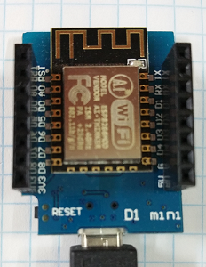

# D1 mini: Demo - class for digital output
Sketch: D1_oop01_Dout1.ino, Version 2017-12-03   
[Deutsche Version](./LIESMICH.md "Deutsche Version")   

Demonstrate methods of class Dout:   
* Turn blue led on 2 sec, then turn off for 2 sec.
* Toggle led every 0,5s and print duration of this state every 0,1s on Serial (115200 Baud).   

## Hardware
* WeMos D1 mini



&nbsp;

**Example for Serial output:**
```
Blue LED on
Blue LED off
*T* 0 100 200 300 400 *T* 0 100 200 300 400 
*T* 0 100 200 300 400 *T* 0 100 200 301 401 
*T* 0 100 200 300 400 *T* 0 100 200 300 401 
*T* 0 100 200 300 400 *T* 0 100 200 300 400 
*T* 0 101 201 301 401 *T* 0 100 200 300 400
```


## Class diagram Dout
| class Dout |     |
| ---------------------------------  | -------- |
| ~ Dout() | constructor (default digital out is D4, not inverted) |
| ~ Dout(int num) | constructor with output pin number (=GPIO, not inverted) |
| ~ Dout(bool invert) | constructor (default outpin is D4), set invert |
| ~ Dout(int num, bool invert) | constructor with pin number and set invert |
| ~ void setup(int num, bool invert) | setup output pin and properties |
| ===== *setter, getter, working methods* ===== |     |
| + void set(int val)           | set output pin physical:  0=0V, 1=3V3 |
| + void on(void)               | set output pin logical on (output value 0|1 depending on invert_)  |
| + void off(void)              | set output pin logical off (output value 0|1 depending on invert_) |
| + void toggle()               | change output on <--> off  |
| + unsigned long getDuration() | get msec since last change |
  
&nbsp;

|  *properties*               |                                           |
| --------------------------- | ----------------------------------------- |
| ~ int  doutNum_             | pin number (default D4 = GPIO2)           |
| ~ bool invert_              | if false: 0=0V 1=3V3, if true: 0=3V3 1=0V |
| ~ int  val_                 | physical output value: 0=0V, 1=3V3        |
| ~ unsigned long lastMilli_  | time in ms (value of millis())            |
  