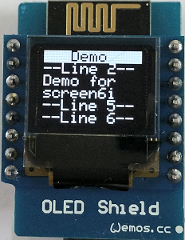
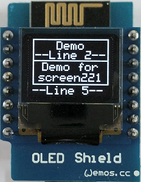
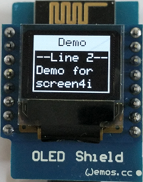
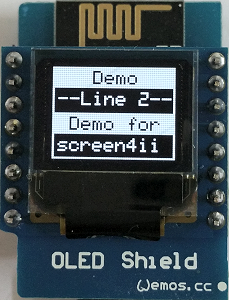
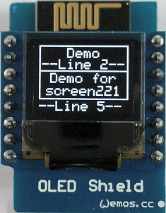
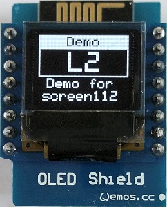
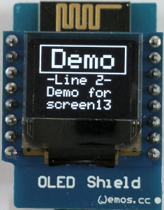
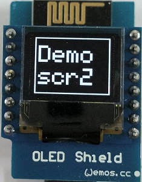

# D1_oop02_oled1_testall 
This example shows writing text on different screens on OLED shield using the class __Display0KH__ . The class extends the class Adafruit_SSD1306, so you can use all commands from this class as well.
The used Adafruit files are in the directory /libs, so you need not search for the zip files.

The 5x8 pixel font is located in /fonts. You can modify every character by using the OpenOffice Calc file myfont5x8.ods.

| files in /libs       | Size         |
| -------------------- | ------------ |
| Adafruit_GFX.cpp     | 32.436 Bytes |
| Adafruit_GFX.h       |  4.944 Bytes |
| Adafruit_SSD1306.cpp | 27.813 Bytes |
| Adafruit_SSD1306.h   |  5.806 Bytes |
| gfxfont.h            |    924 Bytes |
| glcdfont.c           |  8.486 Bytes |

## Hardware
* WeMos D1 mini
* OLED Shield: SSD1306, 64x48 pixel, I2C

## Class diagram
Parameters
* line_ .... line on the oled (1 to max. line 6)
* text_ .... text to write (max. 10 chars or 5 big chars)
* align_ ... align of text (default: 'l'=left. 'c'=center, 'r'=right, 'L'=left+overwrite, 'C'=center+overwrite, 'R'=right+overwrite)
* cls_ ..... clear display (default: false = do not clear display)

screen names (examples)
* screen13 .... 1 line with big chars, 3 lines with normal chars
* screen4 ..... 4 lines with normal chars and border arround
* screen4i .... 4 lines with normal chars, line 1 inverted
* screen4ii ... 4 lines with normal chars, line 1 and 3 inverted

| class Display0KH (extends Adafruit_SSD1306) |
| ------------------------------------------- |
| + Display0KH()   + void screen6 (int line_, String text_, char align_, bool cls_)   + void screen6i(int line_, String text_, char align_, bool cls_)   + void screen5 (int line_, String text_, char align_, bool cls_)   + void screen5i(int line_, String text_, char align_, bool cls_)   +  void screen4 (int line_, String text_, char align_, bool cls_)   + void screen4i(int line_, String text_, char align_, bool cls_)   + void screen4ii(int line_, String text_, char align_, bool cls_)   + void screen221(int line_, String text_, char align_, bool cls_) |
| _screens with big character-lines_ |
| + void screen112(int line_, String text_, char align_, bool cls_)   + void screen13(int line_, String text_, char align_, bool cls_)   + void screen12(int line_, String text_, char align_, bool cls_)   + void screen2 (int line_, String text_, char align_, bool cls_) |
| - String mytrim(int max_, String txt_, char align)   - void scr6(int line_, String text_, char align_, bool cls_, bool invert_)   - void scr5(int line_, String text_, char align_, bool cls_, bool invert_)   - void scr4(int line_, String text_, char align_, bool cls_, bool invert_) |
