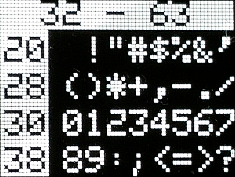
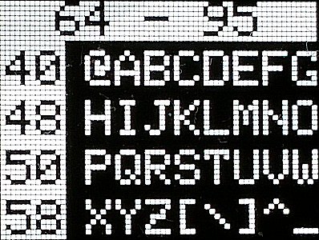
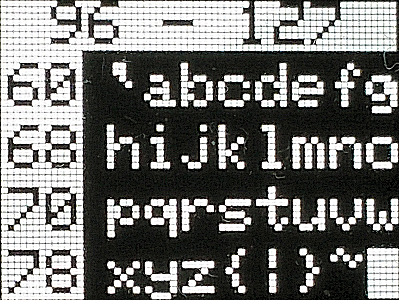
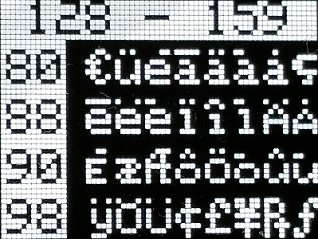
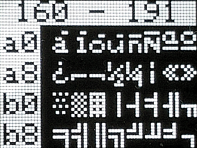
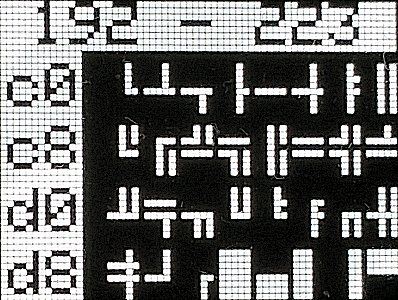
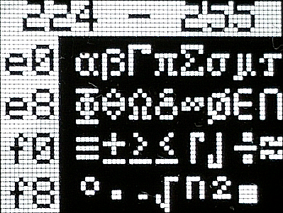

# D1 mini: Anzeige der ASCII Zeichen 32-255 auf dem OLED-Display
Sketch: D1_oop02_oled_ascii.ino, Version 2017-12-30   
[English version](./README.md "English version")   

Dieses Programm zeigt alle ASCII-Zeichen des 5x8 Pixel Font (fontKH_5x8Bitmaps), der in der Klasse  __Screen1__ (Datei `D1_class_Screen1.h`) enthalten ist. Jedes Zeichen kann unter Verwendung der OpenOffice Calc Datei  `myfont5x8.ods` (im Unterverzeichnis `fonteditor`) ver&auml;ndert werden.

## Hardware
* WeMos D1 mini
* OLED Shield: SSD1306, 64x48 pixel, I2C

## Bildschirmkopien

