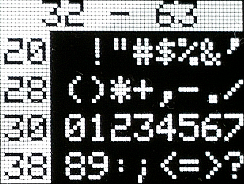
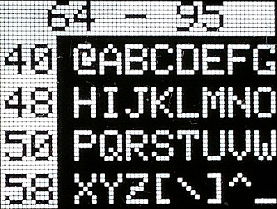
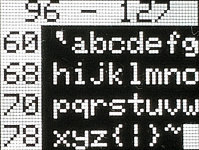
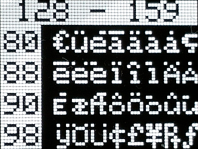
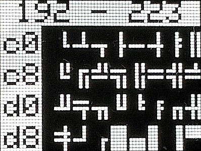
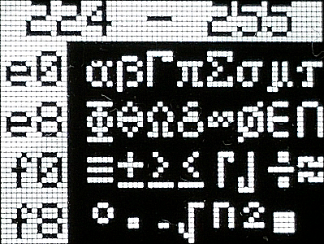

# D1 mini: Show all ASCII characters 32-255 on oled display
Sketch: D1_oop02_oled_ascii.ino, Version 2017-12-30   
[Deutsche Version](./LIESMICH.md "Deutsche Version")   

Show the ascii characters of 5x8 pixel font (fontKH_5x8Bitmaps) included in Class __Screen1__ (file `D1_class_Screen1.h`). You can modify every character by using the OpenOffice Calc file `myfont5x8.ods` from subfolder `fonteditor`.

## Hardware
* WeMos D1 mini
* OLED Shield: SSD1306, 64x48 pixel, I2C

## Screenshots

