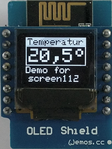

# D1 mini: Einfache Textanzeige auf OLED Display mit screen112
Sketch: D1_oop02_oled_screen112.ino, Version 2017-12-31   
[English version](./README.md "English version")   

Dieses Beispiel zeigt die Verwendung der Klasse __Screen1__ zur einfachen Textdarstellung auf einem OLED Shield. Die Klasse __Screen1__ basiert auf Adafruit Code, der sich in der Datei `D1_class_Screen_64x48.*` befindet.

## Hardware
* WeMos D1 mini
* OLED Shield: SSD1306, 64x48 pixel, I2C

