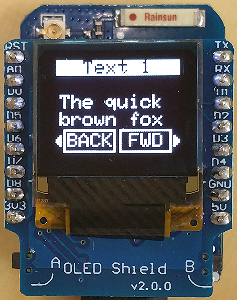

# D1 mini: Demo f&uuml;r vertikales Scrollen von Text (Screen4B)
Sketch: D1_oop02_oled_screen4B_scroll.ino, Version 2018-12-23   
[English version](./README.md "English version")   

Dieses Beispiel zeigt die Verwendung der Klasse __Screen1__ zum vertikalen Scrollen eines Textes auf einem OLED Shield:   
1. Scrollen eines langen Textes.   
2. 18maliges Anzeigen des Textes "Line #" abwechselnd links-, Mitte- und rechtsb&uuml;ndig. Jede 5. Zeile wird invertiert dargestellt.  

   
_Bild 1: D1mini mit OLED und Screen4B_ 

### Vorgangsweise
Der zu scrollende Text wird in die Zeile 7 (!) geschrieben. Ist der Text l&auml;nger als 10 Zeichen, so kann er durch weiteres Schreiben von "Leerzeilen" in Zeile 7 sichtbar gemacht werden.   
__Anmerkung__: Zeile 5 ist der Text f&uuml;r den linken OLED-Taster, Zeile 6 ist der Text f&uuml;r den rechten Taster. (Maximal 4 Zeichen)   

__Anmerkung__: Die Klasse __Screen1__ basiert auf Adafruit Code, der sich in der Datei `D1_class_Screen_64x48.*` befindet.   
Die Datei `D1_class_Screen1a.*` enth&auml;lt den Code der Textbildschirme.

## Hardware
* WeMos D1 mini
* OLED Shield: 0,66", SSD1306, 64x48 pixel, I2C
