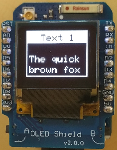

# D1 mini: Demo Screen4: Vertical Scrolling Of Text
Sketch: D1_oop02_oled_screen4_scroll.ino, Version 2018-12-23   
[Deutsche Version](./LIESMICH.md "Deutsche Version")   

This example shows the use of class __Screen1__ to scroll text on OLED shield:   
1. Scroll a long text.   
2. Display 18x text "Line #" cyclic left, middle and right. Invert every 5th line.   

   
_Figure 1: D1mini with OLED and Screen4_ 

### How to do
Write the scrolling text to line 5. Is the text longer than 10 characters, it can be displayed by writing empty lines to line 5.

__Note__: The class __Screen1__ is based on Adafruit code, that is located in files `D1_class_Screen_64x48.*`.   
The file `D1_class_Screen1a.*` contains the code of the text screens.

## Hardware
* WeMos D1 mini
* OLED Shield: 0.66", SSD1306, 64x48 pixel, I2C
