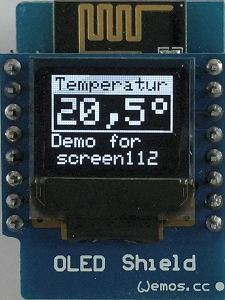

# D1 mini: Simple text display on oled screen112
Sketch: D1_oop02_oled_screen112.ino, Version 2017-12-31   
[Deutsche Version](./LIESMICH.md "Deutsche Version")   

This example shows the use of class __Screen1__ to write text on OLED shield. The class __Screen1__ is based on Adafruit code, that is located in files `D1_class_Screen_64x48.*`.

## Hardware
* WeMos D1 mini
* OLED Shield: SSD1306, 64x48 pixel, I2C

