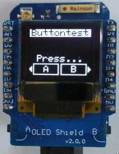

# D1 mini: OLED Display mit 2 integrierten Tastern
Sketch: D1_oop03_oled2button_screen4B.ino, Version 2018-01-27   
[English version](./README.md "English version")   

Dieses Beispiel zeigt die Verwendung der Klasse __Screen1__ zur Textdarstellung auf einem OLED Shield, das 2 Taster integriert hat. Die Klasse __Screen1__ basiert auf Adafruit Code, der sich in der Datei `D1_class_Screen_64x48.*` befindet.

## Hardware
* WeMos D1 mini
* D1 mini OLED Shield V2.0.0 0.66" inch 64X48 IIC I2C two button development board (64x48 pixel, I2C, Taster an D3 und D4)

