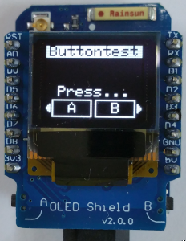

# D1 mini: display text on oled with 2 integrated buttons
Sketch: D1_oop03_oled2button_screen4B.ino, Version 2018-01-27   
[Deutsche Version](./LIESMICH.md "Deutsche Version")   

This example shows the use of class __Screen1__ to write text on a OLED shield with 2 integrated buttons. The class __Screen1__ is based on Adafruit code, that is located in files `D1_class_Screen_64x48.*`.

## Hardware
* WeMos D1 mini
* D1 mini OLED Shield V2.0.0 0.66" inch 64X48 IIC I2C two button development board (64x48 pixel, I2C, button at D3 and D4)

