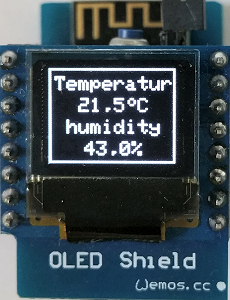

# D1 mini: Simple text display on oled screen4
Sketch: D1_oop03_oled_screen4_V2.ino, Version 2017-12-31   
[Deutsche Version](./LIESMICH.md "Deutsche Version")   

This example shows writing text on a OLED shield using the easy to use class __Screen1__ for displaying text. On the display you see a
* "temperature" 20,0 to 40,0&deg;C (increased by 0,1 &deg; every second) and
* "humidity"    double value of temperature

The class __Screen1__ is based on Adafruit code, that is located in files `D1_class_Screen_64x48.*`.

## Hardware
* WeMos D1 mini
* OLED Shield: SSD1306, 64x48 pixel, I2C

