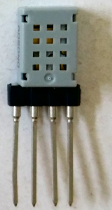

# D1_oop04_AM2322
This example measures temperature and humidity with a AM2322 sensor and sends the values to Serial interface (115200 Baud).

## Hardware
* WeMos D1 mini
* AM2322 sensor on i2c bus (7-bit-address 0x5C)

