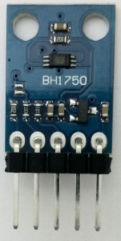

# D1_oop06_BH1750 
This example measures brightness with a digital light sensor BH1750 and sends the value to Serial interface (9600 Baud).
Default i2c address is 0x23 (other option 0x5C).

## Hardware
* WeMos D1 mini
* BH1750 light sensor on i2c bus (7-bit-address 0x23)

