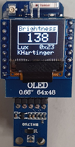
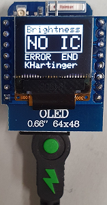

# D1 mini with BH1750: display of brightness on OLED 0.66"
Sketch: D1_oop07_HB1750_oled.ino, Version 2021-02-07   
[--> Deutsche Version](./LIESMICH.md "Deutsche Version")   

Using a BH1750, the brightness is measured and shown on an OLED 0.66" display.   

| ___BH1750___ | Value range | Tolerance |
|:------------- |:---------------------:|:------------------------ |
| Brightness | 0 lx ... 65535 lx | 1 lx or &#x00B1;20% |
   
__Note__   
The first values read in are often incorrect.   

## Hardware
1. WeMos D1 mini (OR ESP32 D1 mini)
2. brightness sensor BH1750 on I2C bus: SCL=D1, SDA=D2, GND, 3V3 (I2C-address 0x23 or 0x5C)
3. OLED Shield: 0.66", SSD1306, 64x48 pixel, I2C @ 0x3C

## Examples for displays
     
_Fig. 1: OLED display with measured value and in case of an error (e.g. no sensor)_   
   
    
_Fig. 2: Sensor BH1750_   
