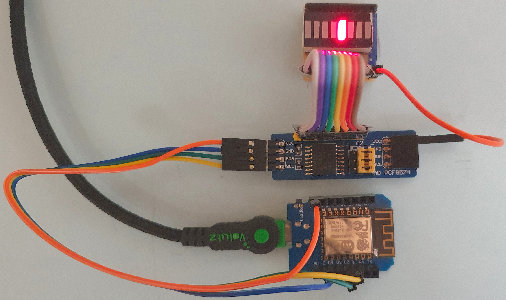
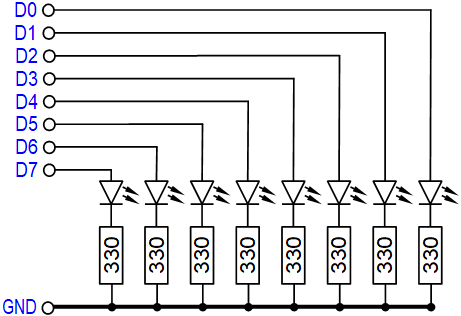
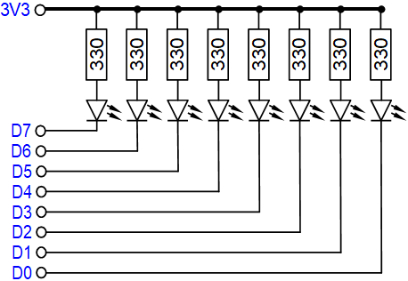

# D1 mini: Lauflicht am PCF8574 Board
Sketch: D1_oop100_PCF8574_1.ino, Version 06.04.2023   
[--> English Version](./README.md "English Version")   

## Funktion
Dieses Programm f&uuml;r den D1 mini oder ESP32mini (ESP32-WROOM-32) macht folgendes:   
1. I2C und PCF8574 Objekt initialisieren, PCF8574-Ausgänge invertieren.   
2. Ausgabe eines Testmusters (zuerst jede zweite LED ein, dann nach einer Sekunde aus).   
3. Ausgabe eines Lauflichts, d.h. der Reihe nach Ein- und Ausschalten der LEDs.   

## Erforderliche Hardware
1. D1 mini oder ESP32mini (ESP32-WROOM-32)   
2. PCF8574 Board   
3. Prototype-Board mit LED-Balken und SIL-Widerstandsarray 8x 330 Ohm   
4. 4poliges Verbindungskabel zum Verbinden des D1 mini mit dem PCF8574 Board   
5. 8poliges Verbindungskabel zum Verbinden des PCF8574 Boards mit dem LED-Balken   
6. Kabel (Stift-Buchse) zur Versorgung des LED-Balkens   

   
_Bild 1: D1 mini mit PCF8574 Board und LED-Balken_   

__*Verbindung der Pins beim I2C-Bus*__   
1. Leitung SCL (gelb) von D1=GPIO5 zum SCL-Anschluss   
2. Leitung SDA (gr&uuml;n), von D2=GPIO4 zum SDA-Anschluss   
3. Versorgungsspannungspins 3V3
4. Massepins GND

## Selbstbau LED-Balken-Proto-Boards
Das Selbstbau TF-Adapter-Shield enth&auml;lt   
* eine 16polige DIL-Fassung mit LED-Balken (KYX-B08R),   
* eine 9polige SIL-Fassung mit Widerstandsarray 8x 330Ohm,   
* eine 9polige Stiftleiste.

Der Aufbau erfolgt auf einer Lochrasterplatine mit Streifen.   

F&uuml;r die Schaltung des LED-Balkens gibt es zwei Möglichkeiten:   
Gemeinsame Verwendung der 3V3-Versorgung oder der gemeinsamen Masse (GND).   

   
_Bild 2: Schaltung mit gemeinsamer Masse GND_   

   
_Bild 3: Schaltung mit gemeinsamer Versorgungsspannung (3V3)_   

__*Unterschied zwischen der beiden Varianten:*__   
* Die Schaltung mit gemeinsamer Masse (GND) zeigt direkt den Zustand der Ausgänge an (Bit=1 ergibt Pin auf 3,3V, LED leuchtet). Da der PCF8574 nur maximal 4mA Ausgangsstrom liefern kann, leuchten die LEDs bei dieser Schaltung nur sehr gering.   
* Die Schaltung mit gemeinsamer Versorgungsspannung (3,3V) zeigt den Zustand der Ausgänge invertiert an (Bit=1 ergibt Pin auf 3,3V, LED leuchtet NICHT). Die LEDs leuchten hell, da ein Eingang des PCF8574 bis zu 50mA nach Masse ziehen kann.   
