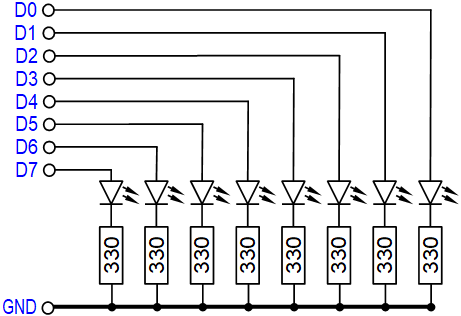
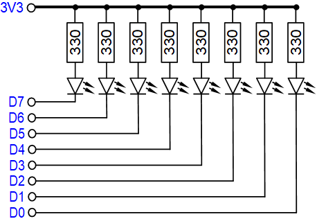

# D1 mini: Running light on PCF8574 board
Sketch: D1_oop100_PCF8574_1.ino, Version 2023-04-06   
[--> Deutsche Version](./LIESMICH.md "Deutsche Version")   

## Function
This program for the D1 mini or ESP32mini (ESP32-WROOM-32) does the following:   
1. initialize I2C and PCF8574 object, invert PCF8574 outputs.   
2. output a test pattern (first every second LED on, then after one second off).   
3. output of a running light, i.e. switching the LEDs on and off in sequence.   

## Hardware required
1. D1 mini or ESP32mini (ESP32-WROOM-32)   
2. PCF8574 board   
3. prototype board with LED bar and SIL resistor array 8x 330 Ohm   
4. 4pin connection cable to connect the D1 mini with the PCF8574 board   
5. 8pin connection cable to connect the PCF8574 board with the LED bar   
6. cable (male-female) for power supply of the LED bar   

   
_Fig. 1: D1 mini with PCF8574 board and LED bar_   

__*Connection of the pins at the I2C bus*__.   
1. line SCL (yellow) from D1=GPIO5 to SCL connector   
2. line SDA (green), from D2=GPIO4 to SDA connector   
3. supply voltage pins 3V3
4. ground pins GND

## Self-construction LED bar proto boards
The DIY TF-Adapter-Shield contains   
* a 16pin DIL socket with LED bar (KYX-B08R),   
* a 9pin SIL socket with resistor array 8x 330Ohm,   
* a 9pin male header.

The assembly is done on a breadboard with strips.   

For the circuit of the LED bar there are two possibilities:   
Common use of the 3V3 supply or common ground (GND).   

   
_Fig. 2: Circuit with common ground GND_   

   
_Fig. 3: Circuit with common supply voltage (3V3)_   

__*Difference between the two variants:*__   
* The circuit with common ground (GND) shows directly the state of the outputs (bit=1 results in pin on 3.3V, LED is on). Since the PCF8574 can only supply a maximum of 4mA output current, the LEDs light up only very slightly with this circuit.   
* The circuit with common supply voltage (3.3V) shows the state of the outputs inverted (bit=1 results in pin on 3.3V, LED does NOT light). The LEDs are bright because one input of the PCF8574 can pull up to 50mA to ground.   