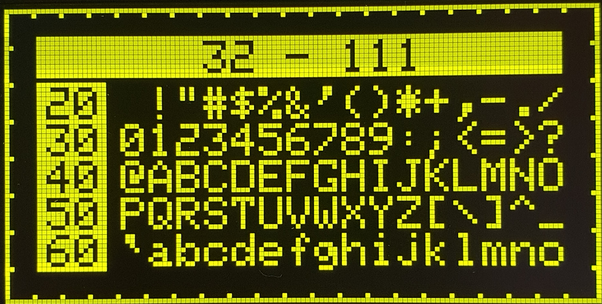
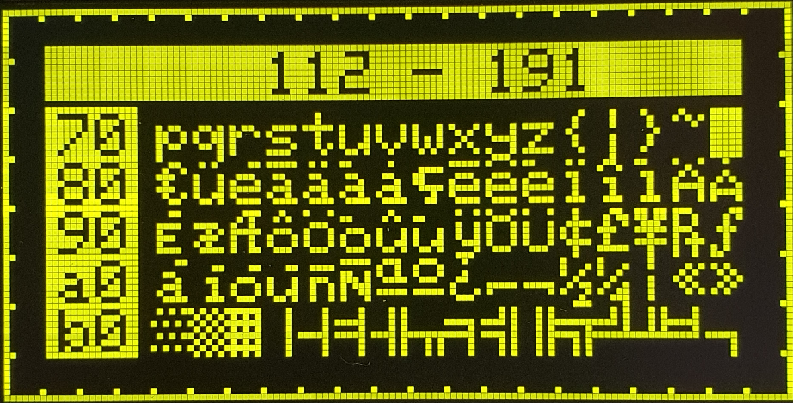
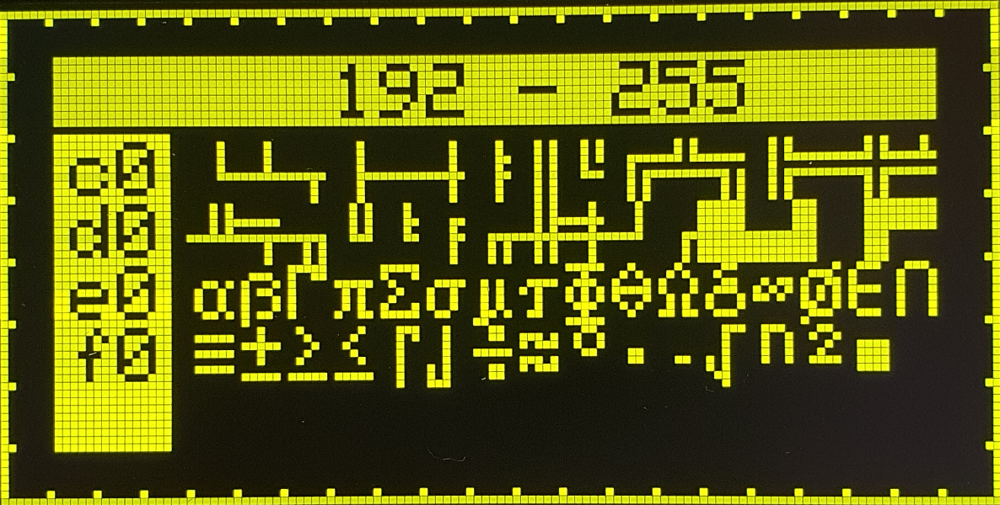

# D1 mini: Anzeige der ASCII Zeichen 32-255 auf einem 1,54" OLED-Display (Code Page 437)
Sketch: D1_oop02_oled154_cp437_V1.ino, Version 2024-02-05   
[English version](./README.md "English version")   

Dieses Programm stellt alle ASCII-Zeichen des Font `u8g2_font_KH_cp437_6x8_mf` auf einem 1,54 inch (oder 2,4") gro&szlig;en OLED-Display mit Treiber SD 1309 dar.   
Die Zeichen entsprechen der Code Page CP437 und sind 6x8 Pixel gro&szlig; (Breite 6, H&ouml;he 8 ).   
Der Font ist in der Klasse  __Screen154__ (Datei `D1_class_Screen154.h`) enthalten und muss auch in der Datei `u8g2.h` deklariert werden:   
(`extern const uint8_t u8g2_font_KH_cp437_6x8_mf[] U8G2_FONT_SECTION("u8g2_font_KH_cp437_6x8_mf");`)   

   
   
   

## &Auml;ndern einzelner Zeichen
Zum Ver&auml;ndern eines Zeichens muss die Datei `font_KH_cp437_6x8_mf.fon` ins Programm `Fony.exe` geladen werden. Nach dem &Auml;ndern der Zeichen die fon-Datei speichern ([x] Monospaced) und als BDF-Datei exportieren ([&nbsp;] Don´t trim glyph bitmaps).   
Die `.bdf`-Datei kann mit Hilfe des Kommandozeilenprogramms `bdfconv.exe` in eine c-Datei umgewandelt werden, die den Code f&uuml;r den Zeichensatz enth&auml;lt:   
`bdfconv -f 1 -m "32-255" -n u8g2_font_KH_cp437_6x8_mf -o font_KH_cp437.c font_KH_cp437_6x8_mf.bdf`   
Siehe dazu auch:   
* [https://github.com/olikraus/u8g2/blob/c7dc077995ca513337a7d2a1970df693e18ee308/doc/faq.txt#L245](https://github.com/olikraus/u8g2/blob/c7dc077995ca513337a7d2a1970df693e18ee308/doc/faq.txt#L245)   
* [https://forum.arduino.cc/t/u8g2-custom-font-tutorial-with-fony/686061](https://forum.arduino.cc/t/u8g2-custom-font-tutorial-with-fony/686061)   

## Hardware
* WeMos D1 mini oder ESP32 D1 mini
* OLED: 1,54" oder 2,4", SSD1309, 128x64 pixel, I2C
