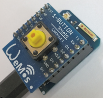

# Di mini: Button D3 as MQTT client
Sketch: D1_oop19_mqtt_V2_buttonD3, Version 2018-05-06   
[ <u>Deutsche Version</u> ](./LIESMICH.md "Deutsche Version")

This sketch connects to a MQTT server via WLAN, then:
* On Power-On a message "button/02" with payload -1 is sent.
* When button D3 is pressed, this is printed to Serial and the value 1 is published under topic "button/02".
* All messages received by topic "button/02" are printed to Serial.   

__*Don't forget to change WiFi data to your network values*__ in line   
`MqttClientKH client("..ssid..", "..password..","mqtt server name");`  

## Hardware
* WeMos D1 mini
* 1-Button Shield D3   

## Technical Info
The class **MqttClientKH** extends the class *PubSubClient* for an easy use of mqtt. So you can use all commands from class *PubSubClient* as well.   
When library *PubSubClient* is installed in arduino IDE, delete files `PubSubClient.h` and `PubSubClient.cpp` in directory `/src/mqtt` and change   
`#include "PubSubClient.h"` to `#include <PubSubClient.h>`   
in file *D1_class_MqttClientKH.h*.

Button D3 is handled by class `D1_class_Din`.

---

## How to make a D1mini mqtt application
1. Setup a broker  
E.g. install mosquitto on Raspberry Pi and start it  
`sudo apt-get install mosquitto`  
`sudo apt-get install mosquitto-clients`  
`sudo /etc/init.d/mosquitto start`  

2. Make a D1 client
* Include the class MqttClientKH  
  `#include "D1_class_MqttClientKH.h"`  
* Define a MqttClientKH object  
  `MqttClientKH client("..ssid..", "..password..","mqtt server name");`  
__*Don't forget to change WiFi data to your network values!*__
* Define a callback function to process subscribed messages (is called by every subscribed topic)  
  `void callback(char* topic, byte* payload, unsigned int length)`  
* in function setup() do mqtt setup:  
  `client.addSubscribe("topic");` subscribe topic (=input). Handle it in  callback()!  
  `client.addPublish("topic", "startvalue");` publish message by given topic  
  `client.setCallback(callback);` set (name of) callback function  
  `client.reconnect();` connect to WLAN and mqtt server  
* in function loop()  
  call `client.isConnected()` to process cyclic check for WLAN and mqtt (automatic reconnect, if connection is lost)  

## Class diagram
| class MqttClientKH (extends PubSubClient) |     |
| ----------------------------------------- | --- |
| + __MqttClientKH__(char* ssid, char* pwd, char* mqtt_server, int port) | default values: mqtt_server="localhost", port=1883  |
| + int  getNumSub()    | get number of subscribed topics |
| + int  getNumPub()    | get number of topics to publish |
| + void clrSubscribe() | set numSub_ to 0 |
| + void clrPublish()   | set numPub_ to 0 |
| + void setClientName(String sName) | set client name |
| + String getClientName() | get client name |

| --- *methods to setup WLAN and mqtt connection* --- |     |
| --------------------------------------------------- | --- |
| + bool setup_wifi()  | (try to) connect to the WiFi network, true on success. |
| + bool reconnect()   | check for connect, if not: try to reconnect |
| + bool __isConnected()__ | is mqtt connection ok? (no: reconnect after MQTT_RECONNECT_MS) |
| + bool sendPubSubTopics() | MQTT: send all PubSub topics to broker, called by reconnect() |
| + void printPubSubTopics2Serial() | just for testing purposes |

| --- *methods to define mqtt topics* --- |     |
| --------------------------------------- | --- |
| + bool __addSubscribe__(String topic) | add a (String) topic to subscribe list (array) |
| + bool __delSubscribe__(String topic) | convert String to array and unsubscribe |
| + bool __addPublish__(String topic, String payload, bool retain) | add a (String) topic to publish list (array) |
| + bool __delPublish__(String topic) | delete publish topic from list |
| + void __publishString__(String topic, String payload) | convert String to array and publish (without registering it) |
| + void __publishString__(String topic, String payload, bool retained) | convert String to array and publish |
| + int  setSubscribe(String aTopicSub[], int num) | set array of registered subscribe topics |
| + int  setPublish(String aTopicPub[], String aPayload[], int num) | set array of publish topics to register |
| + void subscribeString(String topic) | convert String to array and subscribe |

| --- *properties* --- |     |
| -------------------- | --- |
| ~ char ssid_[SSID_SIZE+1] | SSID_SIZE = 20 |
| ~ char pass_[PASS_SIZE+1] | PASS_SIZE = 20 |
| ~ char mqtt_[MQTT_SIZE+1] | name of mqtt server (MQTT_SIZE=20) |
| ~ int  port_ | mqtt port (default 1883) |
| ~ String aTopicSub_[TOPIC_MAX] | array with all subscribed topics (TOPIC_MAX=8) |
| ~ String aTopicPub_[TOPIC_MAX] | array with all topics to publish |
| ~ String aPayloadPub_[TOPIC_MAX] | array with values on (re)connect network |
| ~ bool   aRetainPub_[TOPIC_MAX]  | array with retain values (true &#124; false) |
| ~ int numSub_ | number of subscribed topics |
| ~ int numPub_ | number of topics to publish |
| ~ WiFiClient d1miniClient   | WLAN client for MQTT |
| ~ String sClientName        | MQTT client name |
| ~ long millis_lastConnected | last connection time in ms |

More about class *PubSubClient* see https://github.com/knolleary/pubsubclient

