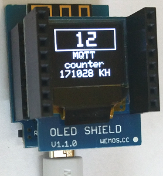

# Di mini: Simple MQTT example using class MqttClientKH
(Sketch D1_oop19_mqtt_V2_counter_oled1)

The class **MqttClientKH** extends the class *PubSubClient* for an easy use of mqtt. So you can use all commands from class *PubSubClient* as well.   
When library *PubSubClient* is installed in arduino IDE, delete files `PubSubClient.h` and `PubSubClient.cpp` in directory `/libs` and change   
`#include "libs/PubSubClient.h"` to `#include <PubSubClient.h>`.

This sketch connects to a MQTT server via WLAN:
* D1 mini subscribes all messages "button/#".
* When message "button/xx" with payload 1 is received, a counter is incremented, the value is displayed on oled shield and printed to Serial (xx is the number of button 00 to 99). Payload 0 resets the counter.
* After that, a message "button/xx/ok" is published containing the counter value.

## Hardware
* WeMos D1 mini
* OLED Shield: SSD1306, 64x48 pixel, I2C   


## Example of Serial output
```
Message received. Topic 'button/02', payload='1'
requestCounter = 3
Message received. Topic 'button/02/ok', payload='3'

Message received. Topic 'button/01', payload='1'
requestCounter = 4
Message received. Topic 'button/01/volt', payload='4.098'
Message received. Topic 'button/01/ok', payload='4'
```
---

## How to make a D1mini mqtt application
1. Setup a broker  
E.g. install mosquitto on Raspberry Pi and start it  
`sudo apt-get install mosquitto`  
`sudo apt-get install mosquitto-clients`  
`sudo /etc/init.d/mosquitto start`  

2. Make a D1 client
* Include the class MqttClientKH  
  `#include "D1_class_MqttClientKH.h"`  
* Define a MqttClientKH object  
  `MqttClientKH client("..ssid..", "..password..","mqtt server name");`  
__*Don't forget to change WiFi data to your network values!*__
* Define a callback function to process subscribed messages (is called by every subscribed topic)  
  `void callback(char* topic, byte* payload, unsigned int length)`  
* in function setup() do mqtt setup:  
  `client.addSubscribe("topic");` subscribe topic (=input). Handle it in  callback()!  
  `client.addPublish("topic", "startvalue");` publish massage by given topic  
  `client.setCallback(callback);` set (name of) callback function  
  `client.reconnect();` connect to WLAN and mqtt server  
* in function loop()  
  call `client.isConnected()` to process cyclic check for WLAN and mqtt (automatic reconnect, if connection is lost)  

## Class diagram
| class MqttClientKH (extends PubSubClient) |     |
| ----------------------------------------- | --- |
| + __MqttClientKH__(char* ssid, char* pwd, char* mqtt_server, int port) | default values: mqtt_server="localhost", port=1883  |
| + int  getNumSub()    | get number of subscribed topics |
| + int  getNumPub()    | get number of topics to publish |
| + void clrSubscribe() | sets numSub_ to 0 |
| + void clrPublish()   | sets numPub_ to 0 |

| --- *methods to setup WLAN and mqtt connection* --- |     |
| --------------------------------------------------- | --- |
| + bool setup_wifi()  | (try to) connect to the WiFi network, true on success. |
| + bool reconnect()   | check for connect, if not: try to reconnect |
| + bool __isConnected()__ | is mqtt connection ok? (no: reconnect after MQTT_RECONNECT_MS |

| --- *methods to define mqtt topics* --- |     |
| --------------------------------------- | --- |
| + bool __addSubscribe__(String topic) | add a (String) topic to subscribe array |
| + bool __delSubscribe__(String topic) | convert String to array and unsubscribe |
| + bool __addPublish__(String topic, String payload) | add a (String) topic to publish array |
| + void __publishString__(String topic, String payload) | convert String to array and publish (without register it) |
| + void __publishString__(String topic, String payload, bool retained) | convert String to array and publish |
| + int  setSubscribe(String aTopicSub[], int num) |set array of registered subscribe topics |
| + int  setPublish(String aTopicPub[], String aPayload[], int num) | set array of subscribe topics to register |
| + void subscribeString(String topic) | convert String to array and subscribe |

| --- *properties* --- |     |
| -------------------- | --- |
| ~ char ssid_[SSID_SIZE+1] | SSID_SIZE = 20 |
| ~ char pass_[PASS_SIZE+1] | PASS_SIZE = 20 |
| ~ char mqtt_[MQTT_SIZE+1] | name of mqtt server (MQTT_SIZE=20) |
| ~ int  port_ | mqtt port (default 1883) |
| ~ String aTopicSub_[TOPIC_MAX] | array with all subscribed topics (TOPIC_MAX=8) |
| ~ String aTopicPub_[TOPIC_MAX] | array with all topics to publish |
| ~ String aPayloadPub_[TOPIC_MAX] | value on (re)start |
| ~ int numSub_ | number of subscribed topics |
| ~ int numPub_ | number of topics to publish |
| ~ WiFiClient d1miniClient   |     |
| ~ long millis_lastConnected |     |

More about class *PubSubClient* see https://github.com/knolleary/pubsubclient
