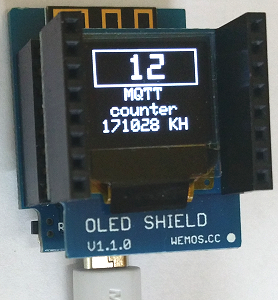

# D1 mini: Einfacher MQTT-Z&auml;hler mit OLED Anzeige
Sketch: D1_oop19_mqtt_counter_oled1, Version 2017-07-21   
[English Version](./README.md "English Version")

Dieses Programm (Sketch) verbindet sich mit dem MQTT-Server &uuml;ber das WLAN und macht folgendes:   
* Der D1 mini abonniert (subscribes) alle Nachrichten vom Typ "button".
* Alle empfangenen Nachrichten werden auf der seriellen Schnittstelle angezeigt.
* Beim Topic "button" wird &uuml;berpr&uuml;ft, ob der Inhalt der Nachricht  (payload) das Zeichen 0 oder 1 ist. Bei 0 wird der Z&auml;hler auf 0 gesetzt, bei 1 der Z&auml;hler um 1 erh&ouml;ht.
* Anschlie&szlig;end wird der Wert &uuml;ber die serielle Schnittstelle &uuml;bertragen, am OLED-Shield angezeigt und eine Nachricht "button" mit dem Z&auml;hlerstand versendet.

__*Nicht vergessen: Die WLAN-Daten an das eigene Netzwerk anpassen*__ in der Zeile:   
`MqttClientKH client("..ssid..", "..password..","mqtt server name");`  

## Hardware
* WeMos D1 mini
* OLED Shield: SSD1306, 64x48 pixel, I2C   

---

## Technische Details
Der MQTT-Client wird mit Hilfe der Klasse **MqttClientKH** erstellt, die die Klasse *PubSubClient* erweitert. Somit k&ouml;nnen auch alle Methoden der Klasse *PubSubClient* verwendet werden.   
Ist die Bibliothek *PubSubClient* in der Arduino IDE installiert, so m&uuml;ssen die Dateien `PubSubClient.h` und `PubSubClient.cpp` im Verzeichnis `/libs` gel&ouml;scht und folgende Zeile in der Datei *D1_oop19_mqtt_V2_powerOff.ino* ge&auml;ndert werden:   
`#include "libs/PubSubClient.h"` auf `#include <PubSubClient.h>`.   

---

## Erstellen einer MQTT-Anwendung auf dem D1 mini
1. MQTT-Broker aufsetzen  
ZB mosquitto auf dem Raspberry Pi installieren und starten:  
`sudo apt-get install mosquitto`  
`sudo apt-get install mosquitto-clients`  
`sudo /etc/init.d/mosquitto start`  

2. D1 Client erstellen
* Klasse MqttClientKH includieren   
  `#include "D1_class_MqttClientKH.h"`  
* MqttClientKH Objekt definieren  
  `MqttClientKH client("..ssid..", "..password..","mqtt server name");`  
__*Nicht vergessen: Die WLAN-Daten an das eigene Netzwerk anpassen!*__   
* Eine Callback Funktion definieren, die die angemeldeten Nachrichten (subscribed messages) bearbeitet.   
  `void callback(char* topic, byte* payload, unsigned int length)`   
  Beachte: Diese Funktion wird von __jedem abonnierten__ (subscribe) Topic aufgerufen!  
* In der Funktion setup() das MQTT-Setup durchf&uuml;hren:  
  `client.addSubscribe("topic");` Eingehende Nachricht anmelden (subscribe topic). Diese wird in callback() bearbeitet.   
  `client.addPublish("topic", "startvalue");` Nachricht definieren, die bei einem Wiederverbinden mit dem Broker gesendet wird.  
  `client.setCallback(callback);` (Name der) Callback-Funktion festlegen.  
  `client.reconnect();` &Uuml;ber WLAN mit dem MQTT-Broker (Server) verbinden.  
* in function loop()  
  Durch die Zeile `client.isConnected()` wird regelm&auml;&szlig;ig die bestehende Verbindung zum WLAN und MQTT-Server kontrolliert (f&uuml;r eingehende Nachrichten wichtig!). Bei Verbindungsverlust wird versucht, die Verbindung wieder herzustellen.

## Klassendiagramm
| class MqttClientKH (extends PubSubClient) |     |
| ----------------------------------------- | --- |
| + __MqttClientKH__(char* ssid, char* pwd, char* mqtt_server, int port) | Vorgabewerte: mqtt_server="localhost", port=1883  |
| + int  getNumSub()    | Anzahl der abonnierten Nachrichten (Topics) |
| + int  getNumPub()    | Anzahl der zur Ver&ouml;ffentlichung angemeldeten Nachrichten bei Verbindungsverlust |
| + void clrSubscribe() | Anzahl der abonnierten Nachrichten auf Null setzen |
| + void clrPublish()   | Anzahl der zu ver&ouml;ffentlichen Nachrichten auf Null setzen |
| + void setClientName(String sName) | Client Namen setzen |
| + String getClientName() | Client Namen holen |

| --- *Methoden zum Aufsetzen der WLAN- und MQTT-Verbindung* --- |     |
| -------------------------------------------------------------- | --- |
| + bool setup_wifi()  | (Versuch zur) Verbindung mit dem WLAN, true bei Erfolg |
| + bool reconnect()   | Auf Verbindung pr&uuml;fen. Wenn nein: Wiederverbindung versuchen |
| + bool __isConnected()__ | Besteht eine MQTT-Verbindung? (Wenn nein: Wiederverbindung nach MQTT_RECONNECT_MS Millisekunden) |
| + bool sendPubSubTopics() | MQTT: Sende alle PubSub-Topics zum Broker. Funktion wird von reconnect() aufgerufen |
| + void printPubSubTopics2Serial() | Ausgabe der Topics &uuml;ber die serielle Schnittstelle (zu Testzwecken) |

| --- *Methoden zur Bearbeitung der MQTT Topics* --- |     |
| -------------------------------------------------- | --- |
| + bool __addSubscribe__(String topic) | (String) Topic zur subscribe-Liste hinzuf&uuml;gen |
| + bool __delSubscribe__(String topic) | Topic aus subscribe-Liste entfernen |
| + bool __addPublish__(String topic, String payload, bool retain) | (String) Topic zur publish-Liste hinzuf&uuml;gen |
| + bool __delPublish__(String topic) | Topic aus publish-Liste entfernen |
| + void __publishString__(String topic, String payload) | String-Wert ver&ouml;ffentlichen (ohne in die Liste aufzunehmen) |
| + void __publishString__(String topic, String payload, bool retained) | String-Wert ver&ouml;ffentlichen (ohne in die Liste aufzunehmen). retained=true: Broker soll sich Wert merken. |
| + int  setSubscribe(String aTopicSub[], int num) | Feld von Topics zur subscribe-Liste hinzuf&uuml;gen |
| + int  setPublish(String aTopicPub[], String aPayload[], int num) | Feld von Topics zur publish-Liste hinzuf&uuml;gen |
| + void subscribeString(String topic) | String-Topic direkt beim Broker anmelden (ohne Aufnahme in subscribe-Liste) |

| --- *Eigenschaften* --- |     |
| ----------------------- | --- |
| ~ char ssid_[SSID_SIZE+1] | SSID_SIZE = 20 |
| ~ char pass_[PASS_SIZE+1] | PASS_SIZE = 20 |
| ~ char mqtt_[MQTT_SIZE+1] | Name des MQTT-Servers (L&auml;nge MQTT_SIZE=20) |
| ~ int  port_ | MQTT-Port (Vorgabe 1883) |
| ~ String aTopicSub_[TOPIC_MAX]   | Liste (array) mit allen abonnierten Topics (TOPIC_MAX=8) |
| ~ String aTopicPub_[TOPIC_MAX]   | Liste (array) mit allen Ver&ouml;ffentlichungs-Topics |
| ~ String aPayloadPub_[TOPIC_MAX] | Liste (array) mit den Werten Ver&ouml;ffentlichungs-Topics |
| ~ bool   aRetainPub_[TOPIC_MAX]  | Liste (array) mit den Retain-Werten (true &#124; false) |
| ~ int numSub_ | Anzahl der subscribe-Topics in der Liste |
| ~ int numPub_ | Anzahl der publish-Topics in der Liste |
| ~ WiFiClient d1miniClient   | WLAN Client for MQTT |
| ~ String sClientName        | Name des MQTT Clients |
| ~ long millis_lastConnected | Zeitpunkt des letzten Verbindungsaufbaus in Millisekunden |

Mehr zur Klasse *PubSubClient* gibt es unter https://github.com/knolleary/pubsubclient
