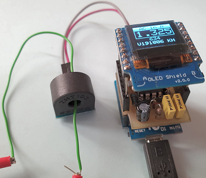

# D1_oop21_AC_INA122_ASM010_oled: Measure alternating current (AC)

This example uses the classes __Ain__ and __Screen1__ to get analog input values and convert them to a current (1000 = 2A).
The voltage is measured 16 times every second and the average is displayed.

## Hardware
* Wemos D1 mini
* OLED Shield: SSD1306, 64x48 pixel, I2C
* Self construction shield D1_INA122 V2
* AC Current transformer ASM-010

