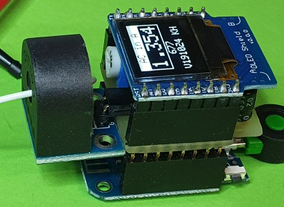

# D1 mini: Anzeige des Analog- und Stromwertes auf dem OLED
Version 2019-10-24, Datei: `D1_oop21_AC_INA122_oled2.ino`   
[English version](./README.md "English version")   

Dieses Beispiel zeigt das Messen von Wechselstrom (engl. alternating current, AC) mit einem "5A Range of Single-Phase AC Current Sensor Module" (AlExpress) und einem Selbstbau-Shield INA122.   
Es zeigt den analogen Wert und den umgerechneten Stromwert jede Sekunde auf deinem 0,66-Zoll OLED und &uuml;ber die serielle Schnittstelle an.   
Verwendung der Klassen __Ain__ und __Screen1a__.

## Hardware
* WeMos D1 mini   
* Stromwandler ASM-010 an einem INA122 Verst&auml;rker Selbstbau-Shield
* OLED Shield: SSD1306, 64x48 pixel, I2C (0x3C)   
  SCL=D1=DGPIO5, SDA=D2=GPIO4, OLED_RESET GPIO0

   
_Figure 1: D1 mini Hardware_

 value on OLED Shield")   
_Bild 2: Messung von Wechselstrom_
