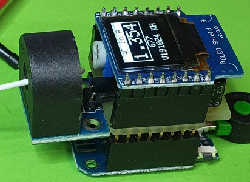

# D1 mini: Show analog input as current on OLED
Version 2019-10-24, File: `D1_oop21_AC_INA122_oled2.ino`   
[Deutsche Version](./LIESMICH.md "Deutsche Version")   

This example demonstrates measuring of alternating current (AC) with a "5A Range of Single-Phase AC Current Sensor Module" (AlExpress) and selfconstruction shield INA122.   
It shows analog input value and current value every second 
on a 0.66" oled and Serial.   
Uses classes __Ain__ and __Screen1a__.

## Hardware
* Wemos D1 mini
* Current transformer ASM-010 at an INA122 amplifier selfconstruction shield
* OLED Shield: SSD1306, 64x48 pixel, I2C (0x3C)   
  SCL=D1=DGPIO5, SDA=D2=GPIO4, OLED_RESET GPIO0

   
_Figure 1: D1 mini hardware_

 value on OLED Shield")   
_Figure 2: Measuring AC_
