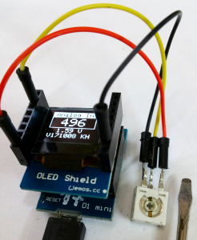

# D1_oop21_ain2oled
This example uses the class __DisplayKH__ to write analog input value and the voltage on OLED shield and to Serial.
The used Adafruit files are in the directory /libs, so you need not search for the zip files.
When Adafruit libs are installed, delete directory /libs!

## Hardware
* Wemos D1 mini
* OLED Shield: SSD1306, 64x48 pixel, I2C
* Potentiometer 10kOhm

