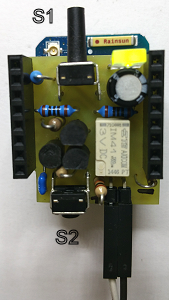
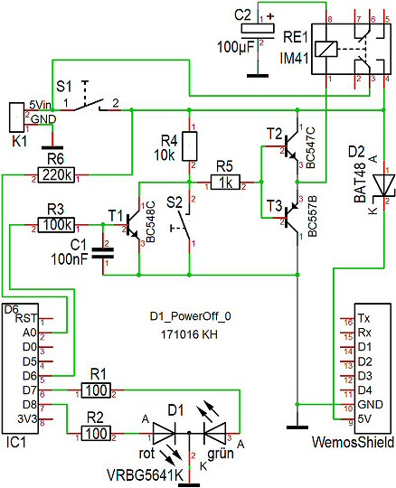
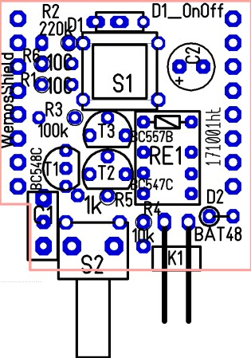
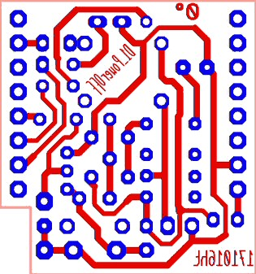
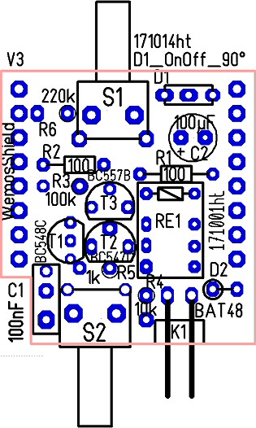
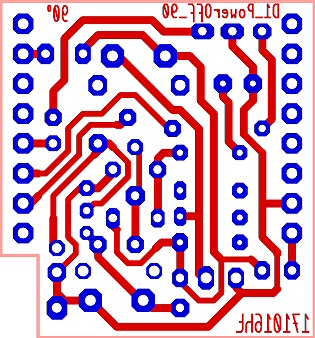

# D1 mini: D1_PowerOff shield

The D1_PowerOff shield is used to power a D1 mini by battery via a relay.
When SET-button S1 on the D1_PowerOff shield is pressed, a bipolar relay is set and power remains switched on even when the button is released.
[Software: pin D6 must be switched off = 0V!].   
Power ist switched off by setting pin D6 to 1 = 3V3 (or by pressing the OFF-button S2 on D1_PowerOff shield)



### Overview of the attributes of D1_PowerOff shield
* 1x button to set relay (S1)
* 1x button to reset relay (S2)
* 2x output pin for DUO-LED (pin D7 = green, D8 = red, both = orange)
* 1x output pin D6 to reset relay (1 = relay off)
* 1x analog input for measuring battery voltage (A0):    
```
  + 5V  (0...5,4V)       | connected to 5V power supply   
220k                     | located on D1_PowerOff shield
  |-----A0  (0...3.2V)   | analog input @ D1 mini
220k                     | located on D1 mini board
  |-----ADC (0...1V)     | analog input @ ESP 8266
100k                     | located on D1 mini board
  +-----GND  
```
**Important: D1 mini power supply via D1_PowerOff shield!** (NOT by USB)

# Software examples

**D1_oop22_PowerOff_6sec**

When SET-button S1 on the D1_PowerOff shield is pressed, the LED lights for 2 seconds red, yellow and green. Then the supply voltage is switched off.   
Possible error: If power voltage is connected to USB, program starts from the beginning...

**D1_oop22_PowerOff_ain_buttonD3**

When SET-button S1 is pressed, D1 mini starts and the LED lights red.   
When button D3 is pressed, the supply voltage is measured, sent to Serial and supply voltage is switched off.   

**D1_oop22_PowerOff_mqtt**

When SET-button S1 is pressed, D1 mini starts and the LED lights red. The D1 mini tries to connect to a mqtt-broker (via WLAN):   
`MqttClientKH client("..ssid..", "..password..","mqttservername");`   
On success the led shines orange and D1 mini publishes the messages `/button/01` (payload 1) and `/button/01/volt` (= power supply voltage x.xxx).   
Then D1 mini waits for a message `/button/01/ok`. If the message ok=1, D1 mini sets the LED to green, waits for 2 seconds and turns off the power (D6=1).   
If there is no connection to the WLAN or no answer ok, power is turned off by software after 20 secs anyway (to save energy :)

# D1_PowerOff shield - Details



K1 ... connector for supply voltage (e.g. battery)

### Part list shield D1_PowerOff_90
| No	| Name	| Value	| Package type |
| ----- | ----- | ----- | ------------ |
| 1	| C1	| 100nF	| 4X8R5,08 |
| 2	| C2	| 100uF	| D5R2,54_ELKO |
| 3	| D1	| VRBG5641K	| DUO-LED_2X5_3POL |
| 4	| D2	| BAT48	| DO35_STEHEND_K_OBEN |
| 5	| IC1	| WemosShield	| Wemos |
| 6     | -     | 2x 8pin Buchsenleiste lang | Wemos |
| 7	| K1	| Stiftleiste_1x02	| 1X02-90 abgewinkelt |
| 8	| R1	| 100	| 0204 |
| 9	| R2	| 100	| 0204 |
| 10	| R3	| 100k	| 0204_STEHEND_MET |
| 11	| R4	| 10k	| 0204_STEHEND_MET |
| 12	| R5	| 1k	| 0204_STEHEND |
| 13	| R6	| 220k	| 0204_STEHEND |
| 14	| RE1	| Relay IM41 3VDC | IM41 |
| 15	| S1	| PHAP3305D	| KURZHUBTASTER_11,85 *) |
| 16	| S2	| PHAP3305D	| KURZHUBTASTER_1,2 |
| 17	| T1	| BC548C	| TO92 |
| 18	| T2	| BC547C	| TO92 |
| 19	| T3	| BC557B	| TO92 |

*) or Button ESE20C321 for shield D1_PowerOff_0.

The difference between *_0 and *_90 shield is just the type of SET-button S2 (0...button direction is top, 90...button in front direction)





   
(board size about 26,6 x 28,5 mm2)
           