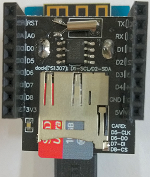

# D1 mini: Setzen von Datum und Uhrzeit bei RTC DS1307 durch einen Server
Sketch: D1_oop23_DS1307_setTimeHttp, Version 2017-11-27   
[English Version](./README.md "English Version")

Demo f&uuml;r Klasse **`TimeHttp`**: Setze Datum und Uhrzeit bei einer Echtzeituhr DS1307 (RTC, Real Time Clock) durch Senden eines HTTP 1.1 Requests 

__*Nicht vergessen: Die WLAN-Daten an das eigene Netzwerk anpassen*__ in der Zeile:   
`TimeHttp time1("..ssid..", "..password..","httpservername");`  

**Verwendung dieses Programms:**
* Durch Senden von s &uuml;ber die serielle Schnittstelle wird Datum und Uhrzeit durch einen HTTP-Request auf die aktuellen Werte gesetzt.
* Durch Senden von r &uuml;ber die serielle Schnittstelle wird Datum und Uhrzeit auf einen Vorgabewert gesetzt.   
(sDateTime0="20161231 235954")
* Datum und Uhrzeit werden alle 2 Sekunden an die serielle Schnittstelle gesendet.

Bei Verwendung der Arduino-IDE zum Senden des Zeit-Strings: Im Drop-Down-Men&uuml; rechts unten im seriellen Monitor muss "Neue Zeile" eingestellt werden!   

Vorgabewert f&uuml;r die I2C-7bit-Adresse ist 0x68.   
Alle Ergebnisse werden auf die serielle Schnittstelle ausgegeben (115200 Baud).

## Hardware
* WeMos D1 mini
* Datenlogger Shield (microSD + DS1307RTC Shield)   
  DS1307  verwendet I2C (D1-SCL, D2-SDA)   
  microSD verwendet SPI (D5-CLK, D6-MISO, D7-MOSI, D8-CS)   



**Beispiel f&uuml;r die Ausgabe auf der seriellen Schnittstelle:**
```
RTC DS1307: OK
Starting a HTTP-request...
Disconnected. Try to reconnect...

Connecting to Raspi11
............
Connected! IP address is 192.168.1.169
Connected to Wifi!
Connected to server!
Normal time. DS1307 set time: OK
Setup: setHttpTime = 20171127 210208
MO 27.11.2017 21:02:08 | Serial: s sends HTTP-Request, r resets time
MO 27.11.2017 21:02:10 | Serial: s sends HTTP-Request, r resets time
MO 27.11.2017 21:02:12 | Serial: s sends HTTP-Request, r resets time
DS1307 reset time: OK
SA 31.12.2016 23:59:54 | Serial: s sends HTTP-Request, r resets time
SA 31.12.2016 23:59:56 | Serial: s sends HTTP-Request, r resets time
SA 31.12.2016 23:59:58 | Serial: s sends HTTP-Request, r resets time
SO 01.01.2017 00:00:00 | Serial: s sends HTTP-Request, r resets time
SO 01.01.2017 00:00:02 | Serial: s sends HTTP-Request, r resets time
Starting a HTTP-request...
Connected to Wifi!
Connected to server!
Normal time. DS1307 set time: OK
MO 27.11.2017 21:02:24 | Serial: s sends HTTP-Request, r resets time
MO 27.11.2017 21:02:26 | Serial: s sends HTTP-Request, r resets time
MO 27.11.2017 21:02:28 | Serial: s sends HTTP-Request, r resets time
```
