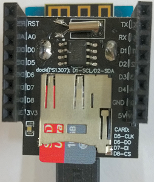

# D1 mini - Demo: Schreiben und Lesen von Dateien aud der micro SD Karte
Sketch: D1_oop24_SDfile_demo.ino, Version 2017-12-03   
[English Version](./README.md "English Version")   

Die Klasse SDfile baut auf der Bibliothek SD Library auf und hilft beim Schreiben und Lesen einzelner Zeilen einer Text-Datei.   

_Annahmen f&uuml;r die Micro SD card (f&uuml;r die SD card library):_    
 FAT16 oder FAT32, 8.3 formatierte Dateinamen, NICHT case-sensitiv (Gro&szlig;- und Kleinschreibung wird nicht unterschieden).

## Hardware
* WeMos D1 mini
* Datenlogger Shield (microSD + DS1307RTC Shield)   
  DS1307  verwendet I2C (D1-SCL, D2-SDA)   
  microSD verwendet SPI (D5-CLK, D6-MISO, D7-MOSI, D8-CS)   



**Beispiel f&uuml;r die Ausgabe auf der seriellen Schnittstelle:**
```
Initializing SD card.....Ready :)

09826c6d
-----micro SD card info---------------------
CardType: SDHC
Partition Fat32
VolumeSize: 14 GB
-----Demo file: /demo.txt-----
Demo file written!
Demo file :)
Does file '/demo.txt' exist: Yes
Remove file: success!
Does file '/demo.txt' exist: No

-----test writeLine, addLine, addFirstLine--
-----Show content of file /demo_new.txt-----
New first line :)
This is (old) line 1
And this is (old) line 2
Finally this is (old) line 3 :)
-----(End of file)--------------------------
First line |New first line :)|
Last line  |Finally this is (old) line 3 :)|
*****demo finished**************************
```

## Klassendiagramm SDfile
| Klasse SDfile                      |     |
| ---------------------------------- | --- |
| + __SDfile__()                     | Konstruktor: Setzen des Vorgabewertes f&uuml;r Dateinamen, setup()   |
| + __SDfile__(String filename)      | Konstruktor: Dateiname, setup()             |
| ~ bool setup(String filename)      | init chipSelect (D8), pr&uuml;fe Dateinamen auf 8.3 Format, init Serial, SD card, ... |
| ===== *setter and getter methods* ===== |     |
| + int    getStatus()               |          |
| + bool   setFilename(String filename) |       |
| + String getFilename()             |          |
| ===== *file working methods* ===== |          |
| + bool   __exists__()              | pr&uuml;fe, ob die Datei existiert | 
| + bool   __remove__()              | entferne (l&ouml;sche) Datei       |
| + bool   show()                    | zeige Dateiinhalt |
| + bool   __writeLine__(String line) | l&ouml;sche die alte Datei und schreibe eine erste Zeile |
| + bool   __addLine__(String line)   | h&auml;nge eine Zeile an die Datei an |
| + bool   addFirstLine(String line) | f&uuml;ge eine erste Zeile in die Datei ein |
| + String __readFirstLine__()       | lies die erste Zeile der Datei  |
| + String __readLastLine__()        | lies die letzte Zeile der Datei |
| + bool   writeDemofile()           | erzeuge eine Demo-Datei mit Inhalt "Demo file :)" |
| ===== *SD card info* =====         |      |
| + int    getCardType()             | SD Kartentyp: 1=SD1, 2=SD2, 3=SDHC, -1=unbekannt, -2=init Fehler |
| + int    getFatType()              | FAT Typ: 16 = FAT16, 32=FAT32, -1=unbekannt |
| + int    getVolumeSize()           | Speichergr&ouml;&szlig;e: 0=unbekannt, >0 GB, <0 MB |
| ===== *little helpers* =====       |      |
| + bool   is83(String filename)     | true: Dateiname entspricht 8.3 Format        |
| + bool   remove(String filename)   | entferne die Datei mit dem angegebenen Namen |
| + String removeLFCR(String line)   | entferne line feed und carriage return vom Zeileninhalt |
  
&nbsp;

|  *properties*               |                                         |
| --------------------------- | --------------------------------------- |
| - int  status               | 0=ok, >0 Fehler                         |
| - String filename_          | Dateiname (Vorgabe: "/demo.txt")        |
| - int chipSelect            | Chip Select Leitung, Vorgabe D8 (f&uuml;r SD utility library) |
| ===== *just for SD card info* ===== |                                 |
| - Sd2Card  card             | f&uuml;r SD-Karteninformation           |
| - SdVolume volume           | f&uuml;r Partitionsinformation (volume) |
| - bool     cardOK           | true: card Objekt is verf&uuml;gbar     |
| - bool     volumeOK         | true: volume Objekt is verf&uuml;gbar   |