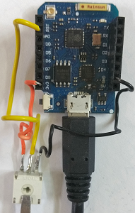

# D1 mini: Beispiel zur Verwendung der Klasse Ain (Analog In)
Sketch: D1_oop25_Ain_demo.ino, Version 2017-11-29   
[English Version](./README.md "English Version")

Funktionen des Beispielprogramms:
* Setzen der Referenzpunkte
* Anzeige der Referenzpunkte
* Einlesen eines Analogwertes pro Sekunde
* Anzeige des Wertes als ganze Zahl (0...1023), String und float 

Status und Resultate werden &uuml;ber die serielle Schnittstelle angezeigt (115200 Baud).   
Zum Test der Funktion des Programms kann der Analogwert zB durch einen Trimmer ver&auml;ndert werden.   

Die Spannung wird mittels einer Ausgleichsgeraden berechnet, die ihrerseits durch zwei Referenzpunkte festgelegt wird. Vorgabewerte sind 0 / 0.0 und 1023 / 3.2. Diese Werte k&ouml;nnen auf folgende Weise ge&auml;ndert werden:
* Punkt 1: Trimmer in Endposition 1 drehen, Analogwert ablesen und gleichzeitig die Spannung mit einem Multimeter messen.
* Punkt 2: Trimmer in die andere Endposition 2 drehen, Analogwert ablesen und wieder die Spannung messen.
* Setzen der Referenzpunkte durch die Methode   
`setRefPoints(int x1, float y1, int x2, float y2);`

## Hardware
* WeMos D1 mini
* Trimmer 10kOhm

 

&nbsp;

**Beispiel f&uuml;r die Ausgabe auf der seriellen Schnittstelle:**
```
Reference points set to 0007/0.000 0997/3.290
8 = 0.00 = 0.0033 V
9 = 0.01 = 0.0066 V
15 = 0.03 = 0.0266 V
503 = 1.65 = 1.6483 V
1003 = 3.31 = 3.3099 V
1003 = 3.31 = 3.3099 V
```

## Klassendiagramm Ain
| Klasse Ain                        |     |
| --------------------------------- | --- |
| + __Ain__()                       | Konstruktor, ruft setup() auf |
| ~ setup() | Setzen der Eigenschaften (A0, P1 0/0.00, P2 1023/3.20, 2 Nachkommastellen) |
| ~ int calcKD(int x1, float y1, int x2, float y2) | Berechnung der Geradengleichungsparameter k und d |
| === *Holen der (neuen) Messwerte* === |     |
| + int    getStatus()            | R&uuml;ckgabe status |
| + int    __getAin1023__()       | Einlesen des Analogwertes und R&uuml;ckgabe als Dezimalzahl 0...1023 |  
| + float  __getVoltage__()       | Einlesen des Analogwertes, Berechnung der Spannung und R&uuml;ckgabe als float |
| + String __getsVoltage__()      | Einlesen des Analogwertes, Berechnung der Spannung und R&uuml;ckgabe als String |
| + String getsVoltage(int decimal_places) | Einlesen des Analogwertes, Berechnung der Spannung und R&uuml;ckgabe als String mit gegebener Anzahl Nachkommastellen |
| === *R&uuml;ckgabe der letzten (vorigen) Messwerte* ===<br>*OHNE neue Messung!* |     |
| + int    __getLastAin1023__()   | R&uuml;ckgabe des (alten) Analogwertes |  
| + float  __getLastVoltage__()   | Berechne nochmals die (vorige) Spannung und gib sie als float zur&uuml;ck |
| + String __getLastsVoltage__()  | Berechne nochmals die (vorige) Spannung und gib sie als String zur&uuml;ck   |
| + String getLastsVoltage(int decimal_places) | Berechne nochmals die (vorige) Spannung und gib sie als String mit gegebener Anzahl Nachkommastellen zur&uuml;ck |
| ===== *Referenzpunkte f&uuml;r die Ausgleichsgerade* ===== |     |
| + int    __setRefPoints__(int x1, float y1, int x2, float y2) | Setze beide Referenzpunkte P1 and P2 |
| + int    setRefPoint1(int x1, float y1) | Setze nur Referenzpunkt P1 |
| + int    setRefPoint2(int x2, float y2) | Setze nur Referenzpunkt P2 |
| + String getRefPoints()         | R&uuml;ckgabe der Referenzpunkte als String x1/y1 x2/y2 |
| ===== *Weitere Methoden* ===== |     |
| + void   setDecimals(int decimal_places) | Definiere die Anzahl der Nachkommastellen f&uuml;r die String-R&uuml;ckgabe |
| + int    getDecimals()          | R&uuml;ckgabe der Anzahl der Nachkommastellen |

&nbsp;

|  *Eigenschaften*        |                                        |
| ----------------------- | -------------------------------------- |
| ~ int    status         | 0=AIN_OK: ok, AIN_ERR_X_RANGE: x<0 or x>1023, AIN_ERR_X_EQUAL: x1=x2,<br> AIN_ERR_Y_RANGE: y<0, AIN_ERR_Y_EQUAL: y1=y2,<br> AIN_ERR_K_NEG: Steigung muss gr&ouml;&szlig;er 0 sein,<br> AIN_ERR_DECIMALS: Anzahl der Nachkommastellen ist kleiner 0 oder gr&ouml;&szlig;er 20 |
| ~ int    pinAin         | Input Pin, Vorgabe ist A0              |
| ~ int    ain_1023       | dezimaler Analogwert 0...1023          |
| ~ int    ain_x1, ain_x2 | x-Werte der Referenzpunkte             |
| ~ float  ain_y1, ain_y2 | y-Werte der Referenzpunkte             |
| ~ float  ain_k, ain_d   | Parameter der Geradengleichung y=k*x+d |
| ~ int    decimals       | Anzahl der Nachkommastellen f&uuml;r die Spannung |
