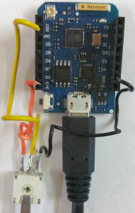
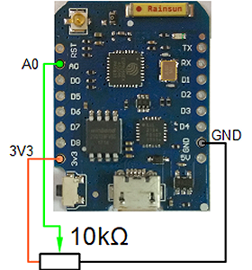

# D1 mini: Demo program for class Ain (analog in)
Sketch: D1_oop25_Ain_demo.ino, Version 2017-11-29   
[Deutsche Version](./LIESMICH.md "Deutsche Version")

Example program:
* set reference points
* print reference points
* read an analog value every second
* show value as decimal value 0...1023, String and float   

Status and results are printed to Serial (115200 Baud).   
To test the function of this program, you can adjust the analog input voltage by a trimmer.   

The voltage is calculated by a straight line, that is defined by two reference points. Default values are 0 / 0.0 and 1023 / 3.2. You can change these points by the following way:    
* get point 1: turn trimmer to end position 1, read input value x1 and measure voltage y1.
* get point 2: turn trimmer to other end position 2, read input value x2 and measure voltage again (y2).
* set reference points by method   
`setRefPoints(int x1, float y1, int x2, float y2);`

## Hardware
* WeMos D1 mini
* Trimmer 10kOhm

 

&nbsp;

**Example for Serial output:**
```
Reference points set to 0007/0.000 0997/3.290
8 = 0.00 = 0.0033 V
9 = 0.01 = 0.0066 V
15 = 0.03 = 0.0266 V
503 = 1.65 = 1.6483 V
1003 = 3.31 = 3.3099 V
1003 = 3.31 = 3.3099 V
```


## Class diagram Ain
| class Ain                       |     |
| ------------------------------- | --- |
| + __Ain__()                     | Constructor, calls setup() |
| ~ setup() | setup properties (A0, P1 0/0.00, P2 1023/3.20, decimals=2) |
| ~ int calcKD(int x1, float y1, int x2, float y2) | calculate straightline equation parameters |
| ===== *get (new) measurement values* ===== |     |
| + int    getStatus()            | return status |
| + int    __getAin1023__()       | read analog in and return decimal value 0...1023 |  
| + float  __getVoltage__()       | read analog in, calculate voltage and return it as float |
| + String __getsVoltage__()      | read analog in, calculate voltage, return String |
| + String getsVoltage(int decimal_places) | read analog in, calculate voltage, return String with given decimal places |
| ===== *get last measurement values* =====<br>*WITHOUT new measurement!* |     |
| + int    __getLastAin1023__()   | return (old) analog in value            |  
| + float  __getLastVoltage__()   | calculate (old) voltage again and return it as float |
| + String __getLastsVoltage__()  | calculate (old) voltage again, return it as String   |
| + String getLastsVoltage(int decimal_places) | calculate (old) voltage, return it as String with given decimals) |
| ===== *reference points for straight line* ===== |     |
| + int    __setRefPoints__(int x1, float y1, int x2, float y2) | set both reference points P1 and P2 |
| + int    setRefPoint1(int x1, float y1) | set only reference point P1 |
| + int    setRefPoint2(int x2, float y2) | set only reference point P2 |
| + String getRefPoints()         | return reference points as String x1/y1 x2/y2 |
| ===== *some more methods* ===== |     |
| + void   setDecimals(int decimal_places) | set number of decimal places for String return |
| + int    getDecimals()          | get number of decimal places |

&nbsp;

|  *properties*               |                                     |
| --------------------------- | ----------------------------------- |
| ~ int    status             | 0=AIN_OK: ok, AIN_ERR_X_RANGE: x<0 or x>1023, AIN_ERR_X_EQUAL: x1=x2,<br> AIN_ERR_Y_RANGE: y<0, AIN_ERR_Y_EQUAL: y1=y2,<br> AIN_ERR_K_NEG: gradient k must be >0, AIN_ERR_DECIMALS: decimals <0, >20 |
| ~ int    pinAin | input pin, default A0 |
| ~ int    ain_1023 | analog decimal value 0...1023 |
| ~ int    ain_x1, ain_x2 | x-values of reference points |
| ~ float  ain_y1, ain_y2 | y-values of reference points |
| ~ float  ain_k, ain_d | straightline equation y=k*x+d |
| ~ int    decimals | number of decimals of voltage |
