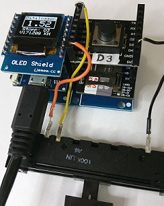

# D1 mini - Demo: Test des Datenlogger Shields (microSD+DS1307RTC-Shield)
Sketch: D1_oop26_checkDatalogger1.ino, Version 2017-12-22   
[English Version](./README.md "English Version")   

Dieses Beispielprogramm liest Analogwerte ein und schreibt sie in eine Datei der FAT-formatierten microSD Karte. Somit ist es m&ouml;glich, die Daten mit Linux- oder Windows-Rechnern zu lesen.   
Nebenbei zeigt das Programm eine Reihe von m&ouml;glichen Anwendungen des D1 mini. Es verwendet digitale Eingabe, digitale Ausgabe, analoge Eingabe, I2C, SPI, WiFi (WLAN) und die serielle Schnittstelle.   

(1) Ein Tastendruck (Click) an D3 startet die Messung:
* Einschalten der blauen LED
* Einlesen des Analogwertes
* Anzeigen des Analogwertes am OLED
* Lesen von Datum und Uhrzeit von der RTC DS1307 (Real Time Clock)
* Schreiben von Datum, Uhrzeit und gemessenen Wert in die Datei "analogin.txt" auf der microSD-Karte
* Nach 2 Sekunden erfolgt die n&auml;chste Messung (Zykluszeit 100ms)

(2) Ein weiterer Tastendruck (Click) an D3
* stoppt die Messung
* schaltet die blaue LED aus

(3) Ein langer Tastendruck an D3 startet die Zeitsynchronisierung:
* Versuch, sich mit dem WLAN zu verbinden
* Holen des aktuellen Datums und der Zeit von einem Server
* Schreiben von Datum und Uhrzeit in die RTC DS1307 (Real Time Clock)

Status und Ergebnisse werden &uuml;ber die serielle Schnittstelle angezeigt (115200 Baud).     

__*Nicht vergessen: Die WLAN-Daten an das eigene Netzwerk anpassen*__ in der Zeile:   
`TimeHttp time1("..ssid..", "..password..","httpservername");`  

## Hardware
* WeMos D1 mini
* Datenlogger Shield (microSD + DS1307RTC Shield) incl. SD-Karte   
  DS1307  verwendet I2C (D1-SCL, D2-SDA)   
  microSD verwendet SPI (D5-CLK, D6-MISO, D7-MOSI, D8-CS)   
* Digitale Eingabe: Button Shield D3 oder mit einem Draht (siehe Bild 2: wei&szlig;er Draht. Taster gedr&uuml;ckt bedeutet D3 kurz mit GND verbinden)
* Analogwert: Poti 10kOhm zwischen 3V3, A0 und 0V
* Optional: OLED Shield (SSD1306, 64x48 pixel, I2C)
* Optional: Double Socket Dual Base Shield D1 Mini (siehe Bild 3). Damit kann man den OLED Shield und den Button Shield gleichzeitig verwenden.




## Software
Folgende Klassen werden f&uuml;r dieses Programm ben&ouml;tigt:   
* `SDfile` ....... Dateibearbeitung auf der micro SD Karte
* `DS1307` ....... Uhr (RTC = Real Time Clock)
* `TimeHttp` ... Holen von Datum und Uhrzeit von einem Server
* `Dout` .......... Ein- und Ausschalten der blauen LED
* `Din` ........... Start and Stopp der Messung
* `Ain` ........... Einlesen des Analogwertes

**Beispiel f&uuml;r die Ausgabe auf der seriellen Schnittstelle:**
```
Start: Press D3!
Starting a HTTP-request...
Connected to Wifi!
Connected to server!
DS1307 time old=20171223 115941, new=20171223 115942
23.12.2017 11:59:52 2.31 V
23.12.2017 11:59:54 2.31 V
23.12.2017 11:59:56 2.87 V
23.12.2017 11:59:58 1.86 V

-----File content----------
23.12.2017 11:59:52 2.31 V
23.12.2017 11:59:54 2.31 V
23.12.2017 11:59:56 2.87 V
23.12.2017 11:59:58 1.86 V
---------------------------
```
