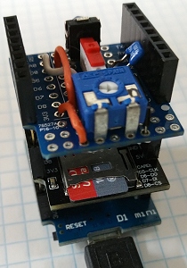
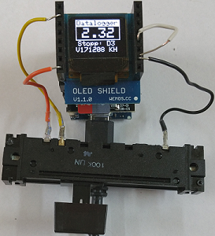
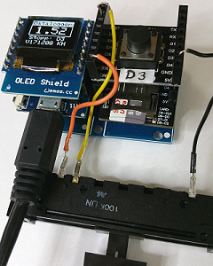

# D1 mini - demo: Check Data Logger Shield (microSD+DS1307RTC-Shield)
Sketch: D1_oop26_checkDatalogger1.ino, Version 2017-12-22   
[Deutsche Version](./LIESMICH.md "Deutsche Version")   

This program writes analog measurement values into a file on a FAT-formatted microSD card, so you can read the data with Linux or Windows PCs.   
By this way it shows a lot of the possible applications with D1 mini. It uses Digital Input, Digital Output, Analog Input, I2C, SPI, WiFi (WLAN) and Serial Interface. 
 
(1) A short keystroke (click) on D3 starts measuring:
* turn blue led on  
* read analog input value
* display value on oled
* read date and time from RTC DS1307
* write date, time and analog measurement value to file "analogin.txt" on microSD card
* start the next measurement after 2 seconds (cyclic time 100ms)   

(2) Another short keystroke (click) on D3
* stopps measuring and 
* turns off the blue led.   

(3) A long keystroke (long click) on D3 starts time synchronisation:
* Try to connect to WLAN
* fetch actual time from a server and 
* write date and time to RTC.   

Results are printed on Serial (115200 Baud).

__*Don't forget to change WiFi data to your network values*__ in line   
`TimeHttp time1("..ssid..", "..password..","httpservername");`  

## Hardware
* WeMos D1 mini
* Data logger shield (microSD + DS1307RTC Shield) with microSD card    
  DS1307  uses I2C (D1-SCL, D2-SDA)   
  microSD uses SPI (D5-CLK, D6-MISO, D7-MOSI, D8-CS)   
* Digital Input: Button shield D3 or a wire (see picture 2: white wire. Button pressed means D3 connected to GND)
* Analog value: E.g. Poti 10kOhm between 3V3 - A0 - 0V
* Optional: OLED Shield (SSD1306, 64x48 pixel, I2C)
* Optional: Double Socket Dual Base Shield D1 Mini (see picture 3), so you can use the OLED shield and the button shield at the same time.





## Software
The following classes are needed for the program:
* `SDfile` ....... file management on micro SD card
* `DS1307` ....... real time clock
* `TimeHttp` ... get time from a server
* `Dout` .......... switch blue led on and off
* `Din` ........... start and stopp measuring
* `Ain` ........... get analog input value

**Example for Serial output:**
```
Start: Press D3!
Starting a HTTP-request...
Connected to Wifi!
Connected to server!
DS1307 time old=20171223 115941, new=20171223 115942
23.12.2017 11:59:52 2.31 V
23.12.2017 11:59:54 2.31 V
23.12.2017 11:59:56 2.87 V
23.12.2017 11:59:58 1.86 V

-----File content----------
23.12.2017 11:59:52 2.31 V
23.12.2017 11:59:54 2.31 V
23.12.2017 11:59:56 2.87 V
23.12.2017 11:59:58 1.86 V
--------------------------- 
```
