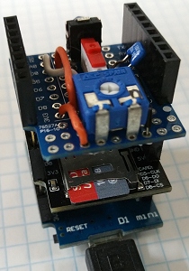

# D1 mini - demo: data logger shield
Sketch: D1_oop26_datalogger_demo1.ino, Version 2017-12-03   
[Deutsche Version](./LIESMICH.md "Deutsche Version")   

Read 5 analog in values and write them with date and time into file "analogin.txt" on microSD card. Status and results are printed to Serial (115200 Baud).     
* Setup: init Serial, blue led on, reference points analog in.
* Setup: old data file on micro SD is deleted (removed).
* Setup: try to connect to WLAN, fetch actual time from a server and write it to RTC. If no success, use old RTC time.
* Loop : read analog value, print it and write it into file.
* Finish: turn blue led off.
* Finish: print file content to Serial.

__*Don't forget to change WiFi data to your network values*__ in line   
`TimeHttp time1("..ssid..", "..password..","httpservername");`  

## Hardware
* WeMos D1 mini
* Data logger shield (microSD + DS1307RTC Shield)   
  DS1307  uses I2C (D1-SCL, D2-SDA)   
  microSD uses SPI (D5-CLK, D6-MISO, D7-MOSI, D8-CS)   
* poti 10kOhm between 3V3 - 0V



## Software
The following classes are needed for the program:
* Dout    : switch blue led on and off
* Ain     : get analog in value
* DS1307  : real time clock
* TimeHttp: get time from a server
* SDfile  : file management on micro SD card

**Example for Serial output:**
```
Initializing SD card.....Ready :)

09826c6d

Starting a HTTP-request...
Disconnected. Try to reconnect...

Connecting to Raspi11
...........
Connected! IP address is 192.168.1.169
Connected to Wifi!
Connected to server!
DS1307 set time: OK
1: 1.49 V
2: 1.10 V
3: 0.87 V
4: 0.45 V
5: 0.08 V

--Measurement finished - File content:--
03.12.2017 18:33:28 1.49 V
03.12.2017 18:33:30 1.10 V
03.12.2017 18:33:32 0.87 V
03.12.2017 18:33:34 0.45 V
03.12.2017 18:33:36 0.08 V
```
