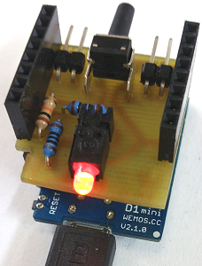
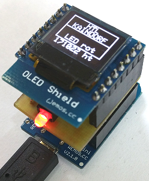
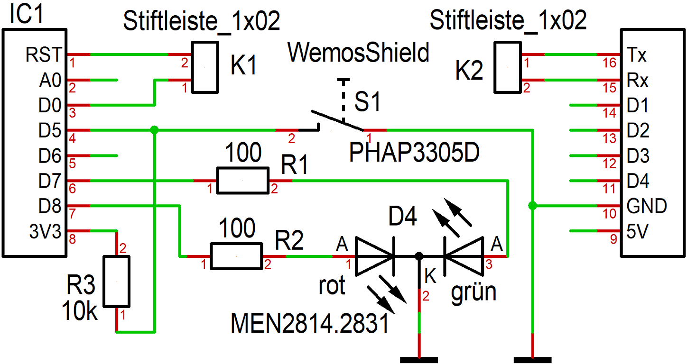
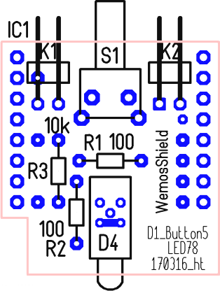
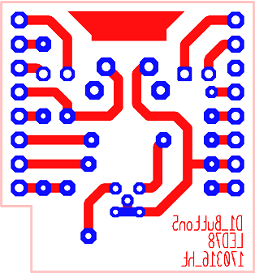

# D1 mini: D1_oop28_test_IO_Shield_oled1

This sketch (programm) demonstrates the function of the self-made shield D1_Button5_LED78 and shows the state on a OLED. The red LED lights up for 2s, then the green LED for 0,5s and so on. If button is pressed, both LEDs are on (=> yellow, if DUO-LED is used).

## Hardware
* **WeMos D1 mini**
* **D1_Button5_LED78:** 2x LEDs at D7 (green), D8 (red), 1x Button at D5
* **OLED Shield:** SSD1306, 64x48 pixel, I2C (SCL GPIO5, SDA GPIO4, OLED_RESET GPIO0)

   

## Software
 The required Adafruit-files were copied from the zip-files
  * Adafruit_SSD1306-esp8266-64x48.zip and
  * Adafruit-GFX-Library-1.1.5.zip   

to directory `/libs`.   
When Adafruit libs are installed, delete directory `/libs`!   
&nbsp;

# D1_Button5_LED78 shield - Details

   

### Part list shield D1_PowerOff_90
| No	| Name	| Value	| Package type |
| ----- | ----- | ----- | ------------ |
| 1	| D4	| MEN2814.2831	| EINZEL-LED-BAUSTEIN_DUO | 
| 2	| IC1	| WemosShield	| Wemos | 
| 3	| K1	| Stiftleiste_1x02	| 1X02-90 | 
| 4	| K2	| Stiftleiste_1x02	| 1X02-90 | 
| 5	| R1	| 100	| 0204 | 
| 6	| R2	| 100	| 0204 | 
| 7	| R3	| 10k	| 0204 | 
| 8	| S1	| PHAP3305D	| KURZHUBTASTER_11,85 | 

   

