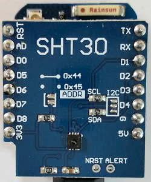

# D1 mini: Anzeige von Temperatur und Feuchtigkeit &uuml;ber die serielle Schnittstelle
Sketch: D1_oop29_SHT30.ino, Version 2018-02-10   
[English Version](./README.md "English Version")   

Dieses Beispiel misst Temperatur und Feuchtigkeit unter Verwendung des Sensors SHT30 und zeigt die Werte &uuml;ber die serielle Schnittstelle an.   
Die Messwerte werden mit der Methode `getValues()` geholt.   

| ___SHT30___ | Bereich | Toleranz |
|:------------ |:----------------------:|:------------ |   
| Temperatur   | -40&deg;C...+125&deg;C | &#x00B1;0,7% (0&deg;..+65&deg;C: +-0,2&deg;C) |   
| Feuchtigkeit | 0%...100%              | &#x00B1;2%RH |   

## Hardware
* WeMos D1 mini
* SHT30 Shield (I2C-Adresse 0x45)



**Beispiel f&uuml;r die serielle Ausgabe:**   
```
Temperatur: 24.9°C, Feuchtigkeit: 29.1%
Temperatur: 24.9°C, Feuchtigkeit: 29.1%
Temperatur: 25.0°C, Feuchtigkeit: 29.0%
```

## Klassendiagramm SHT30


|  &#x0023;define      | Wert   | Bedeutung                                  |   
|:-------------------- |:------ |:------------------------------------------ |   
| SHT30_ADDR           | 0x45   | Vorgabe 7-bit Adresse                      |   
| MEASURING_DELAY_MS   | 500    | (Mindest-)Zeit zwischen zwei Messungen     |   
| SHT30_ERR_VALUE      | -999   | float Wert, wenn ein Fehler auftritt       |   
| SHT30_FT(tmp)        | ((175.0 * (tmp) / 65535.0) - 45) | Umwandlung des 16-bit-Temperaturwertes in float    |   
| SHT30_FH(hum)        | (100.0 * (hum) / 65535.0)        | Umwandlung des 16-bit-Feuchtigkeitswertes in float |   
| ===== *status* ===== |        |                                            |   
| SHT30_OK             | 0      | OK, Erfolg                                 |   
| SHT30_ERR_TOO_LONG   | 1      | I2C Sendepuffer ist zu klein f&uuml;r die Daten |   
| SHT30_ERR_NACK_ADDR  | 2      | Keine Best&auml;tigung (ACK) nach Adressbyte   |   
| SHT30_ERR_NACK_DATA  | 3      | Keine Best&auml;tigung (ACK) nach Datenbyte    |   
| SHT30_ERR_OTHER      | 4      | I2C Fehler                                 |   
| SHT30_ERR_NUM_BYTES  | 5      | Falsche Anzahl Bytes                       |   
| SHT30_ERR_NO_BYTE    | 6      | Kein Byte empfangen                        |   
| SHT30_ERR_NUM_CHARS  | 7      | Falsche Anzahl an Bytes                    |   
| SHT30_ERR_RANGE      | 8      | Wert au&szlig;erhalb des zul&auml;ssigen Bereichs |   
| SHT30_ERR_CRC        | 9      | Pr&uuml;fsummenfehler                         |   
| SHT30_ERR_NO_MEAS    | 10     | Es wurde noch keine Messung durchgef&uuml;hrt |   
   
&nbsp;
   
| Klasse SHT30                  |                                               |
| ----------------------------- | --------------------------------------------- |
| + __SHT30__()                 | Vorgabe Konstruktor, settzt die I2C-Adresse auf 0x45, ruft  setup() auf |
| + SHT30(int i2c_address)      | Konstruktor, setzt I2C-Adresse auf den gegebenen Wert, ruft setup() auf |
| ~ void setup()                | Startet I2C, setzt Eigenschaften auf Vorgabewerte |
| + void __begin__()            | Setzt Sensor zur&uuml;ck und startet eine Messung |
| + void softReset()            | Setzt Sensor zur&uuml;ck                          |
| ===== *setter, getter Methoden* ===== |                                           |
| + int    __getStatus__()      | Ergibt Status als Ganzzahl                        |
| + String getsStatus()         | Ergibt Status als deutscher Text (String)         |
| + float  getTemperature()     | Startet eine Messung, ergibt Temperatur als float Wert |
| + String getsTemperature(int len, int&nbsp;decimals) | Startet eine Messung, ergibt Temperatur als Zeichenkette (Format len.decimals) |
| + float  getHumidity()        | Startet eine Messung, ergibt Feuchtigkeit als float Wert |
| + String getsHumidity(int len, int&nbsp;decimals) | Startet eine Messung, ergibt Feuchtigkeit als Zeichenkette (Format len.decimals) |
| + int    __getValues__(float &temperature, float&nbsp;&humidity) | Startet eine Messung, ergibt Temperatur und Feuchtigkeit als float Werte |
| ===== *ergibt Messwert ohne eine Messung zu starten* ===== |                |
| + String getsLastTemperature(int len, int&nbsp;decimals) | Ergibt Temperatur als Zeichenkette (Format len.decimals) |
| + String getsLastHumidity   (int&nbsp;len, int&nbsp;decimals) | Ergibt Feuchtigkeit als Zeichenkette (Format len.decimals) |
| + int&nbsp;   getLastValues(float &temperature, float&nbsp;&humidity) | Ergibt Temperatur und Feuchtigkeit als float Werte |
| ===== *helper methods* ===== |                   |
| ~ void    measuring()        | Pr&uuml;ft, ob eine Messung erlaubt ist und f&uuml;hrt, wenn erlaubt, eine Messung durch |
| ~ unsigned char calcCRC(unsigned char *idata, int&nbsp;len) | Berechnet 8-bit-Pr&uuml;fsumme CRC (Polynom: 0x31 (x8 + x5 + x4 + 1), Startwert: 0xFF, End-XOR: 0x00 |
| ~ String  float2String(float f, int&nbsp;len, int&nbsp;decimals) | Wandelt float in Zeichenkette um (Format len.decimals) |

&nbsp;

|  *Eigenschaften*                |                                                        |   
| ------------------------------- | ------------------------------------------------------ |   
| ~ int&nbsp;i2cAddress           | I2C-Adresse (Vorgabewert 0x45, weitere M&ouml;glichkeit 0x44) |   
| ~ int&nbsp;status               | Status der I2C-Kommunikation und der Messwerte         |   
| ~ unsigned long next_measuring_ | Zeitpunkt der n&auml;chsten Messung (in Millisekunden) |   
| ~ unsigned int&nbsp;hum_        | 16bit Feuchtigkeitswert (0xFFFF = 100%, 0 = 0%)        |   
| ~ unsigned int&nbsp;tmp_        | 16bit Temperaturwert (0xFFFF = 175&deg;C, 0 = -40&deg;C) |   
