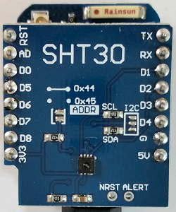

# D1 mini: display temperature and humidity on Serial
Sketch: D1_oop29_SHT30a.ino, Version 2018-02-10   
[Deutsche Version](./LIESMICH.md "Deutsche Version")   

This example measures temperature and humidity using a SHT30 sensor and shows the values on Serial.   
Measurement values are fetched by `getsTemperature()` and `getsHumidity()` (return formated strings).   

| ___SHT30___ | Range | Tolerance |
|:--------- |:-----:|:--------- |   
| Temperature | -40&deg;C...+125&deg;C | &#x00B1;0,7% (0&deg;..+65&deg;C: +-0,2&deg;C) |   
| Humidity    | 0%...100% | &#x00B1;2%RH |   

## Hardware
* WeMos D1 mini
* SHT30 Shield (I2C-address 0x45)



**Example for Serial output:**   
```
------------------1234567890
Temperatur  in °C:   28.7
Feuchtigkeit in %:   25.5772
------------------1234567890
Temperatur  in °C:   28.7
Feuchtigkeit in %:   25.5909
```

## Class diagram SHT30

| &#x0023;define       | Value  | Meaning                     |
|:-------------------- |:------ |:--------------------------- |
| SHT30_ADDR           | 0x45   | default 7-bit address       |
| MEASURING_DELAY_MS   | 500    | time between 2 measurements |
| SHT30_ERR_VALUE      | -999   | float value, if an error occurred |
| SHT30_FT(tmp)        | ((175.0 * (tmp) / 65535.0) - 45) | convert temperature 16-bit value to float |
| SHT30_FH(hum)        | (100.0 * (hum) / 65535.0)        | convert humidity 16-bit value to float    |
| ===== *status* ===== |        |                             |
| SHT30_OK             | 0      | success                     |
| SHT30_ERR_TOO_LONG   | 1      | i2c data too long to fit in transmit buffer |
| SHT30_ERR_NACK_ADDR  | 2      | i2c NACK transmit address   |
| SHT30_ERR_NACK_DATA  | 3      | i2c NACK transmit data      |
| SHT30_ERR_OTHER      | 4      | i2c other error             |
| SHT30_ERR_NUM_BYTES  | 5      | i2c wrong number of bytes   |
| SHT30_ERR_NO_BYTE    | 6      | no byte received            |
| SHT30_ERR_NUM_CHARS  | 7      | wrong number of chars       |
| SHT30_ERR_RANGE      | 8      | wrong range                 |
| SHT30_ERR_CRC        | 9      | wrong crc                   |
| SHT30_ERR_NO_MEAS    | 10     | no measure until now        |

&nbsp;

| class SHT30                   |                                               |
| ----------------------------- | --------------------------------------------- |
| + __SHT30__()                 | default constructor, sets i2c address to 0x45, calls setup() |
| + SHT30(int i2c_address)      | constructor, sets i2c address to given value, calls setup()  |
| ~ void setup()                | begin i2c, set properties to default values   |
| + void __begin__()            | reset sensor and start a measuring            |
| + void softReset()            | reset sensor                                  |
| ===== *setter, getter methods* ===== |                                        |
| + int    __getStatus__()      | get state as int value                        |
| + String getsStatus()         | get state as german text string               |
| + float  getTemperature()     | start a measurement, get temperature as float value |
| + String getsTemperature(int len, int decimals) | start a measurement, get temperature as string (format len.decimals) |
| + float  getHumidity()        | start a measurement, get humidity as float value    |
| + String getsHumidity(int len, int decimals) | start a measurement, get humidity as string (format len.decimals) |
| + int    __getValues__(float &temperature, float &humidity) | start a measurement, get temperature and humidity as float values |
| ===== *get (last) values without making a measurement* ===== |                |
| + String getsLastTemperature(int len, int decimals) | get temperature as string (format len.decimals) |
| + String getsLastHumidity   (int len, int decimals) | get humidity as string (format len.decimals)    |
| + int    getLastValues(float &temperature, float &humidity) | get temperature and humidity as float   |
| ===== *helper methods* ===== |                   |
| ~ void    measuring()        | check, if it is time for measurement, do a measuring |
| ~ unsigned char calcCRC(unsigned char *idata, int len) | calculate 8 bit CRC (polynomial: 0x31 (x8 + x5 + x4 + 1), initialization: 0xFF, final XOR: 0x00 |
| ~ String  float2String(float f, int len, int decimals) | convert float to String (format len.decimals) |

&nbsp;

|  *properties*                   |                                                        |
| ------------------------------- | ------------------------------------------------------ |
| ~ int i2cAddress                | I2C address (default 0x45, other 0x44)                 |
| ~ int status                    | state of I2C communication and measurement values      |
| ~ unsigned long next_measuring_ | time of next measuring (in milli seconds)              |
| ~ unsigned int hum_             | 16bit humidity (0xFFFF = 100%, 0 = 0%)                 |
| ~ unsigned int tmp_             | 16bit temperature (0xFFFF = 175&deg;C, 0 = -40&deg;C)  |
