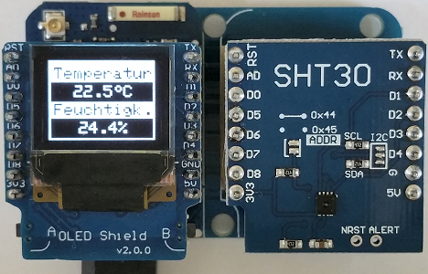

# D1 mini: Anzeige von Temperatur und Feuchtigkeit auf der OLED-Anzeige
Sketch: D1_oop30_SHT30_oled.ino, Version 2018-02-10   
[English Version](./README.md "English Version")   

Dieses Beispiel misst Temperatur und Feuchtigkeit unter Verwendung des Sensors SHT30 und zeigt die Werte auf dem OLED Shield an.   
| ___SHT30___  | Wertebereich           | Toleranz     |
|:------------ |:----------------------:|:------------ |   
| Temperatur   | -40&deg;C...+125&deg;C | &#x00B1;0,7% (0&deg;..+65&deg;C: +-0,2&deg;C) |   
| Feuchtigkeit | 0%...100%              | &#x00B1;2%RH |   

## Hardware
* WeMos D1 mini
* SHT30 Shield (I2C-Adresse 0x45)
* OLED Shield  (SSD1306, 64x48 pixel, I2C-Adresse 0x3D)
* (Dual Base Shield bei Bedarf)

