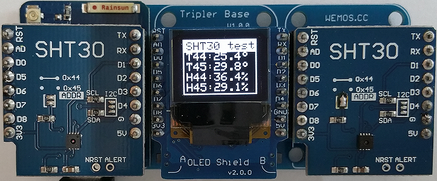

# D1 mini: Vergleich der Messwerte zweier SHT30 Shields auf OLED-Anzeige
Sketch: D1_oop31_2xSHT30_oled.ino, Version 2018-02-10   
[English Version](./README.md "English Version")   

Dieses Beispiel misst Temperatur und Feuchtigkeit unter Verwendung zweier SHT30 Sensoren und zeigt die Werte auf dem OLED Shield an.   
Es zeigt die Temperaturdifferenz, wenn ein SHT30 Shield direkt &uuml;ber dem D1mini montiert ist oder etwas weiter weg. (Zus&auml;tzliche Erw&auml;rmung durch den D1mini.)   

| ___SHT30___  | Wertebereich           | Toleranz     |
|:------------ |:----------------------:|:------------ |   
| Temperatur   | -40&deg;C...+125&deg;C | &#x00B1;0,7% (0&deg;..+65&deg;C: +-0,2&deg;C) |   
| Feuchtigkeit | 0%...100%              | &#x00B1;2%RH |   

## Hardware
* WeMos D1 mini
* 2x SHT30 Shield (I2C-Adresse 0x45 und 0x44)
* OLED Shield  (SSD1306, 64x48 pixel, I2C-Adresse 0x3D)
* Tripler Base Shield

Die Raumtemperatur bleibt nach dem Tausch der Sensoren nahezu gleich: 25,4&deg;C bzw. 25,6&deg;C.   
Der D1mini und SHT30 Sensor mit Adresse 0x45 ergibt auf der linken Seite 29,8&deg;C, das ist um 4,4&deg;C mehr.    
   
   
Um den Einfluss der SHT30 Shields auszuschalten, werden diese ausgetauscht und einige Minuten gewartet: Ergebnis ist 31,6&deg;C auf der D1mini Seite (links), das ist 6,0&deg;C mehr als auf der rechten Seite.    
   
