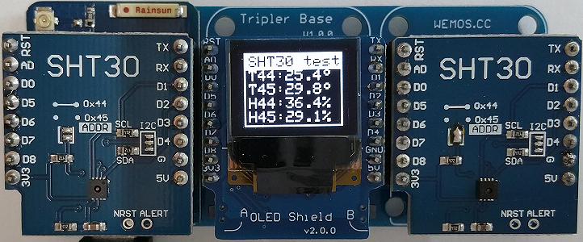
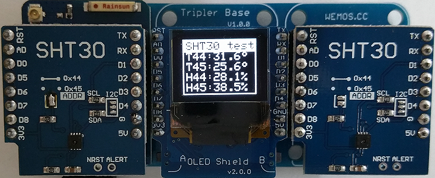

# D1 mini: compare values of two SHT30 shields and show them on oled
Sketch: D1_oop31_2xSHT30_oled.ino, Version 2018-02-10   
[Deutsche Version](./LIESMICH.md "Deutsche Version")   

This example measures temperature and humidity using two SHT30 sensors and shows the values on an oled shield.   
Demonstrates the temperature difference, when a SHT30 shield is mounted directly above D1mini or away from it. (Additional heating due to the D1mini.)
| ___SHT30___ | Range | Tolerance |
|:--------- |:-----:|:--------- |   
| Temperature | -40&deg;C...+125&deg;C | &#x00B1;0,7% (0&deg;..+65&deg;C: +-0,2&deg;C) |   
| Humidity    | 0%...100% | &#x00B1;2%RH |   

## Hardware
* WeMos D1 mini
* 2x SHT30 Shield (I2C-address 0x45 and 0x44)
* OLED Shield  (SSD1306, 64x48 pixel, I2C-address 0x3D)
* Tripler Base Shield

The temperature away from the D1mini is after the swap of the sensors nearly the same: 25,4&deg;C or 25,6&deg;C.   
D1mini and SHT30-Address 0x45 on the left side: 29,8&deg;C, that is 4,4&deg;C more than on the right side.    
   
   
To eliminate the influence of different SHT30 shields, swap the shields and wait some minutes: result is 31,6&deg;C on the D1mini side (left), that is 6,0&deg;C more than on the right side.    
   
