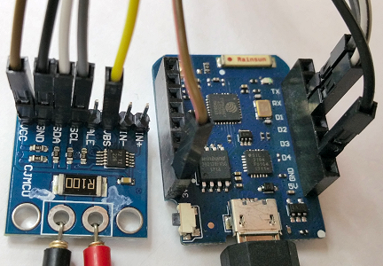

# D1 mini: Measure current, voltage and power with INA226
Sketch: D1_oop32_INA226.ino, Version 2018-02-18   
[--> Deutsche Version](./LIESMICH.md "Deutsche Version")   

This sample programm reads voltage, current and power from a INA226 vial i2c bus and shows the values on Serial.

## Hardware
* WeMos D1 mini
* CJMCU-226 board connected to I2C-Bus of D1 mini: SCL=D1, SDA=D2, 3V3, GND

   

## INA226
The INA226 is a current shunt and power monitor with an I2C
interface. The device monitors both a shunt voltage drop 
and bus supply voltage.
Programmable calibration value, conversion times, averaging,
combined with an internal multiplier, enable direct readouts
of current and power in watts.   

| ___INA226___              | Range                 | Tolerance        |   
|:--------------------------|:---------------------:|:----------------:|   
| Supply voltage            | 2,7V to 5,5V          | max. 6V          |   
| Bus-Voltage               | 0V to 36V             | max. -40V or 40V |   
| Shunt voltage input range | -81,9175mV to 81,92mV | -                |   
   
Software see also https://github.com/jarzebski/Arduino-INA226