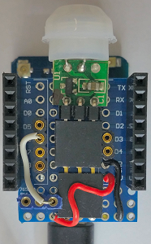

# D1 mini: Bewegungssensor HC-SR505 als MQTT-Client
Sketch: D1_oop33_mqtt_SR505.ino, Version 2018-03-09   
[<u>English Version</u>](./README.md "English Version")

Ein Bewegungssensor HC-SR505 wird mit Hilfe eines D1 mini mit einem MQTT Server verbunden.
* Beim Einschalten (Power-On) werden alle Nachrichten `button/90` angefordert (subscribe) und die Nachrichten (messages) `button/90` und `button/90/t` mit dem Inhalt (payload) -1 gesendet (ver&ouml;ffentlicht).
* Wird der Bewegungsmelder aktiviert (Wechsel von 0V auf 3V3), so wird dies &uuml;ber D6 gemeldet, &uuml;ber die serielle Schnittstelle angezeigt (9600 Baud) und der Wert 1 unter dem Topic `button/02` sowie die Zeit seit dem letzten Event unter dem Topic `button/02/t` ver&ouml;ffentlicht.
* Alle Nachrichten (messages) mit dem Topic `button/90` werden empfangen und &uuml;ber die serielle Schnittstelle angezeigt.   

__*Nicht vergessen: Die WLAN-Daten an das eigene Netzwerk anpassen*__ in der Zeile:   
`MqttClientKH client("..ssid..", "..password..","mqtt server name");`  

## Hardware   

* WeMos D1 mini
* HC-SR505 Mini PIR Motion Sensor (5V, D6, GND)    

    
_Bild links: Anschluss des SR505 am D1 mini.   
Bild rechts: Mini-Bewegungsmelder auf Protoboard montiert._

## Technische Details 
Der MQTT-Client wird mit Hilfe der Klasse **MqttClientKH** erstellt, die die Klasse *PubSubClient* erweitert. Somit k&ouml;nnen auch alle Methoden der Klasse *PubSubClient* verwendet werden.   
Ist die Bibliothek *PubSubClient* in der Arduino IDE installiert, so m&uuml;ssen die Dateien `PubSubClient.h` und `PubSubClient.cpp` im Verzeichnis `/libs` gel&ouml;scht und folgende Zeile in der Datei *D1_oop19_mqtt_V2_buttonD3.ino* ge&auml;ndert werden:   
`#include "libs/PubSubClient.h"` auf `#include <PubSubClient.h>`.   

Zum Einlesen des Bewegungssensors an D6 wird die Klasse `D1_class_Din` verwendet.

## Ausgabe auf der seriellen Schnittstelle

```
Connecting to Raspberry
.......
Connected! IP address is 192.168.0.180
MQTT: Not connected - reconnect...
=====button/90 connected======
-----publish topic list (2)-------
button/90=-1, retain=false
button/90/t=-1, retain=false
-----subscribe topic list (1)-----
button/90/#
==============================
Message received for topic button/90/ok=380
Message received for topic button/90/t=0 00:00:21
Message received for topic button/90=1
Message received for topic button/90/ok=380
0 00:00:11
Motion detected!
Message received for topic button/90=1
Message received for topic button/90/t=0 00:00:11
Message received for topic button/90/ok=381
3.7sec
Ready for next motion detection...

```

---

## Erstellen einer MQTT-Anwendung auf dem D1 mini
1. MQTT-Broker aufsetzen  
ZB mosquitto auf dem Raspberry Pi installieren und starten:  
`sudo apt-get install mosquitto`    
`sudo apt-get install mosquitto-clients`    
`sudo /etc/init.d/mosquitto start`    

2. D1 Client erstellen
* Klasse MqttClientKH includieren   
  `#include "D1_class_MqttClientKH.h"`  
* MqttClientKH Objekt definieren  
  `MqttClientKH client("..ssid..", "..password..","mqtt server name");`  
__*Nicht vergessen: Die WLAN-Daten an das eigene Netzwerk anpassen!*__   
* Eine Callback Funktion definieren, die die angemeldeten Nachrichten (subscribed messages) bearbeitet.   
  `void callback(char* topic, byte* payload, unsigned int length)`   
  Beachte: Diese Funktion wird von __jedem abonnierten__ (subscribe) Topic aufgerufen!  
* In der Funktion setup() das MQTT-Setup durchf&uuml;hren:  
  `client.addSubscribe("topic");` Eingehende Nachricht anmelden (subscribe topic). Diese wird in callback() bearbeitet.   
  `client.addPublish("topic", "startvalue");` Nachricht definieren, die bei einem Wiederverbinden mit dem Broker gesendet wird.  
  `client.setCallback(callback);` (Name der) Callback-Funktion festlegen.  
  `client.reconnect();` &Uuml;ber WLAN mit dem MQTT-Broker (Server) verbinden.  
* in function loop()  
  Durch die Zeile `client.isConnected()` wird regelm&auml;&szlig;ig die bestehende Verbindung zum WLAN und MQTT-Server kontrolliert (f&uuml;r eingehende Nachrichten wichtig!). Bei Verbindungsverlust wird versucht, die Verbindung wieder herzustellen.

Mehr zur Klasse *PubSubClient* gibt es unter https://github.com/knolleary/pubsubclient
