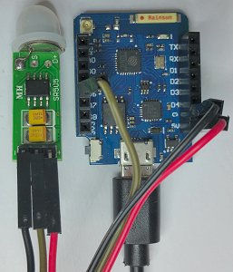

# D1 mini: HC-SR505 Mini PIR Motion Sensor motion sensor as MQTT client
Sketch: D1_oop33_mqtt_SR505.ino, Version 2018-03-09     
[Deutsche Version](./LIESMICH.md "Deutsche Version") 

This scetch connects a HC-SR505 Mini PIR Motion Sensor motion sensor as MQTT client using a D1 mini.

* On Power-On all messages `button/02` are subscribed and messages `button/02` and `button/02/t` are published with payload -1.
* A motion detection (output 0V to 3V3) changes input D6 and printed to Serial (9600 Baud). Message `button/02` is published with payload 1 and message `button/02/t` publishes the time since last event.
* All messages received by topic "button/90" are printed to Serial.   

__*Don't forget to change WiFi data to your network values*__ in line   
`MqttClientKH client("..ssid..", "..password..","mqtt server name");`  

## Hardware
* WeMos D1 mini
* HC-SR505 Mini PIR Motion Sensor (5V, D6, GND)    

    
_Left picture: SR505 wired to D1 mini.   
Right picture: Mini PIR Motion Sensor mounted on protoboard._

## Technical Info   
The class **MqttClientKH** extends the class *PubSubClient* for easy use of mqtt. So you can also use all commands from class *PubSubClient*.   
When library *PubSubClient* is installed in arduino IDE, delete files `PubSubClient.h` and `PubSubClient.cpp` in directory `/libs` and change   
`#include "libs/PubSubClient.h"` to `#include <PubSubClient.h>`.   

HC-SR505 Mini PIR Motion Sensor (D6) is handled by class `D1_class_Din`.

## Example for Serial output

```
Connecting to Raspberry
.......
Connected! IP address is 192.168.0.180
MQTT: Not connected - reconnect...
=====button/90 connected======
-----publish topic list (2)-------
button/90=-1, retain=false
button/90/t=-1, retain=false
-----subscribe topic list (1)-----
button/90/#
==============================
Message received for topic button/90/ok=380
Message received for topic button/90/t=0 00:00:21
Message received for topic button/90=1
Message received for topic button/90/ok=380
0 00:00:11
Motion detected!
Message received for topic button/90=1
Message received for topic button/90/t=0 00:00:11
Message received for topic button/90/ok=381
3.7sec
Ready for next motion detection...

```

---

## How to make a D1mini mqtt application
1. Setup a broker  
E.g. install mosquitto on Raspberry Pi and start it  
`sudo apt-get install mosquitto`  
`sudo apt-get install mosquitto-clients`  
`sudo /etc/init.d/mosquitto start`  

2. Make a D1 client
* Include the class MqttClientKH  
  `#include "D1_class_MqttClientKH.h"`  
* Define a MqttClientKH object  
  `MqttClientKH client("..ssid..", "..password..","mqtt server name");`  
__*Don't forget to change WiFi data to your network values!*__
* Define a callback function to process subscribed messages (is called by every subscribed topic)  
  `void callback(char* topic, byte* payload, unsigned int length)`  
* in function setup() do mqtt setup:  
  `client.addSubscribe("topic");` subscribe topic (=input). Handle it in  callback()!  
  `client.addPublish("topic", "startvalue");` publish message by given topic  
  `client.setCallback(callback);` set (name of) callback function  
  `client.reconnect();` connect to WLAN and mqtt server  
* in function loop()  
  call `client.isConnected()` to process cyclic check for WLAN and mqtt (automatic reconnect, if connection is lost)  

More about class *PubSubClient* see https://github.com/knolleary/pubsubclient

