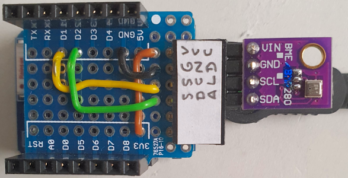

# D1 mini mit BME280: Anzeige von Temperatur, Feuchtigkeit, Luftdruck und H&ouml;he &uuml;ber die RS-232
Sketch: D1_oop34_BME280.ino, Version 2021-02-07   
[--> English Version](./README.md "English Version")   

Dieses Beispielprogramm zeigt das Messen von Temperatur, Feuchtigkeit, Luftdruck und H&ouml;he mit Hilfe des Sensors BME280. Die Werte werden im Abstand von 2 Sekunden gemessen und &uuml;ber die serielle Schnittstelle (RS-232, 115200 Baud) angezeigt.   
Verwendet man statt des BME280 einen Sensor BMP280, so ist der Feuchtigkeitswert immer 0, da dieser Sensor keine Luftfeuchtigkeit messen kann ;) 
   
| ___BME280___  | Wertebereich          | Toleranz     |
|:------------- |:---------------------:|:------------ |
| Temperatur    | -40&deg;C...+85&deg;C | &#x00B1;1&deg;C (0,01&deg;C Aufl&ouml;sung) |
| Feuchtigkeit  | 0%...100%             | &#x00B1;3%RH |
| Luftdruck     | 300...1100hPa         | &#x00B1;1,0hPa |   
   
__Anmerkung__   
Der erste eingelesene Wert ist oft fehlerhaft und sollte nicht verwendet werden ;)   

## Hardware
* WeMos D1 Mini
* BME280 am I2C-Bus: SCL=D1, SDA=D2, GND, 3V3 (I2C-Adresse 0x76 oder 0x77)

**Beispiel f&uuml;r die Ausgabe auf der seriellen Schnittstelle:**
```
setup(): --Start--
BME280 found!        
I2C address: 0x76    
setup(): --Finished--

Measurement started!
New Result: {"T":24.2,"H":32.2,"p":959.7,"a":456.0}
Old Result: 24.23 | 32.15 | 960 | 456.0
Old Result: T=24.23*C, H=32.15%, p=959.66hPa, a=456.04m
--------------------------------------------
Measurement started!
New Result: {"T":24.2,"H":32.2,"p":959.6,"a":456.5}
Old Result: 24.24 | 32.16 | 960 | 456.5
Old Result: T=24.24*C, H=32.16%, p=959.61hPa, a=456.52m
--------------------------------------------
```

    
_Bild 1: D1 mini mit I2C-Adapter f&uuml;r BME280_   
