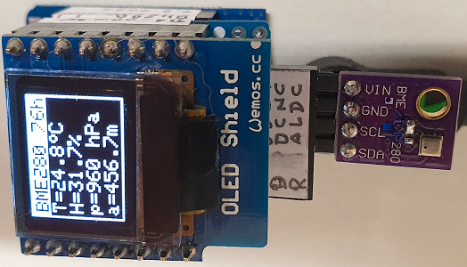

# D1 mini mit BME280: Anzeige von Temperatur, Feuchtigkeit, Luftdruck und H&ouml;he auf OLED 0,66" und RS-232
Sketch: D1_oop35_BME280_oled.ino, Version 2021-02-07   
[--> English Version](./README.md "English Version")   

Dieses Beispielprogramm zeigt das Messen von Temperatur, Feuchtigkeit, Luftdruck und H&ouml;he mit Hilfe des Sensors BME280. Die Werte werden im Abstand von 2 Sekunden gemessen und auf einem 0,66" OLED sowie &uuml;ber die serielle Schnittstelle (RS-232, 115200 Baud) angezeigt.   
Verwendet man statt des BME280 einen Sensor BMP280, so ist der Feuchtigkeitswert immer 0, da dieser Sensor keine Luftfeuchtigkeit messen kann ;) 
   
| ___BME280___  | Wertebereich          | Toleranz     |
|:------------- |:---------------------:|:------------ |
| Temperatur    | -40&deg;C...+85&deg;C | &#x00B1;1&deg;C (0,01&deg;C Aufl&ouml;sung) |
| Feuchtigkeit  | 0%...100%             | &#x00B1;3%RH |
| Luftdruck     | 300...1100hPa         | &#x00B1;1,0hPa |   
   
__Anmerkung__   
Der erste eingelesene Wert ist oft fehlerhaft und sollte nicht verwendet werden ;)   

## Hardware
1. WeMos D1 mini (OR ESP32 D1 mini)
2. BME280 am I2C-Bus: SCL=D1, SDA=D2, GND, 3V3 (I2C-address 0x76 or 0x77)
3. OLED Shield: 0.66", SSD1306, 64x48 pixel, I2C @ 0x3C

**Beispiel f&uuml;r die Ausgabe auf der seriellen Schnittstelle:**
```
setup(): --Start--
BME280 found!
I2C address: 76h
Wait until the first measure has been completed...
setup(): --Finished--

T=24.6°C, H=32.8%, p=960 hPa, a=456.6m
T=24.7°C, H=32.4%, p=960 hPa, a=456.4m
```

    
_Bild 1: D1 mini mit I2C-Adapter und 0,66" OLED_   
