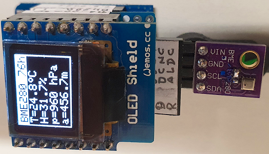

# D1 mini with BME280: Show temperature, humidity, pressure and altitude on OLED 0.66" and RS-232
Sketch: D1_oop35_BME280_oled.ino, Version 2021-02-07   
[--> Deutsche Version](./LIESMICH.md "Deutsche Version")   

This sample programme shows how to measure temperature, humidity, air pressure and altitude using the BME280 sensor. The values are measured at intervals of 2 seconds and displayed on a 0.66" OLED and via the serial interface (RS-232, 115200 baud).   
If you use a BMP280 sensor instead of the BME280, the humidity value is always 0, because this sensor cannot measure humidity ;) 
   
| ___BME280___  | Range                 | Tolerance     |
|:------------- |:---------------------:|:------------- |
| temperature   | -40&deg;C...+85&deg;C | &#x00B1;1&deg;C (0,01&deg;C resolution) |
| humidity      | 0%...100%             | &#x00B1;3%RH   |
| pressure      | 300...1100hPa         | &#x00B1;1,0hPa |   
   
__Note__   
The first value read in is often incorrect and should not be used ;)   
   
## Hardware
1. WeMos D1 mini (OR ESP32 D1 mini)
2. BME280 connected to I2C: SCL=D1, SDA=D2, GND, 3V3 (I2C-address 0x76 or 0x77)
3. OLED Shield: 0.66", SSD1306, 64x48 pixel, I2C @ 0x3C

**Example for Serial output:**
```
setup(): --Start--
BME280 found!
I2C address: 76h
Wait until the first measure has been completed...
setup(): --Finished--

T=24.6°C, H=32.8%, p=960 hPa, a=456.6m
T=24.7°C, H=32.4%, p=960 hPa, a=456.4m
```

    
_Fig. 1: D1 mini with I2C adapter and 0.66" OLED_   

