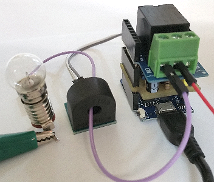

# Einfaches MQTT-Lampen-System
Version 2018-11-01

## Ben&ouml;tigte Systeme
1. Raspberry Pi mit installiertem Mosquitto-Broker   
WLAN: `MqttClientKH client("Raspi10", "12345678","10.1.1.1");`   
2. D1 mini mit Relay-Shield   
ev. zus&auml;tzlich zur Strommessung: D1mini_INA122_V2_170925 Selbstbau-Shield mit Wandler ASM-010   
Software: `D1_oop42_mqtt_relais1.ino`   
3. D1 mini mit 1-Button-Shield   
Software: `D1_oop46_mqtt_button1_blueledint`   
4. D1 mini mit D1_VccImpuls-Shield   
Software: `D1_oop45_mqtt_button_pulsPowerOn1.ino`   

   
_Bild 1: D1mini mit Eigenbau INA122 Shield, Relais Shield, Stromwandler ASM-010 und Lampe_   

## Inbetriebnahme
1. Raspberry Pi starten, Mosquitto-Broker starten   

2. Lampenstromkreis an zB 9V Wechselspannung anschlie&szlig;en:   
9V~ - Relais (mittlerer Anschluss) - Relais (NO Anschluss) - Leiter durch ASM-010 hindurchf&uuml;hren - Lampe(n) - 9V~   
3. ASM-010 Analogausgang an D1mini_INA122-Selbstbau-Shield anschlie&szlig;en
4. Relais-Shield mit USB-Stromversorgung verbinden   

5. Den zweiten D1 mini mit 1-Button-Shield &uuml;ber USB-Anschluss mit Spannung versorgen:   
Mit Hilfe des Tasters kann die Lampe ein- und ausgeschaltet werden.

