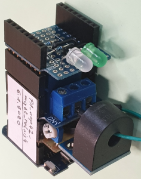

# D1 mini: Switch a lamp by a relay and MQTT
Version 2020-01-10 D1_oop42_mqtt_relais1.ino   
[German version](./LIESMICH.md "German version")   

This example uses a D1 mini as MQTT client to switch a lamp via a relay and measure the current. If the D1 mini receives a topic `relay1/set/relay` with the content (payload) `on`, it switches the relay on, with `off` it switches the relay off and with payload `toggle` it toggles the relay.   

The two LEDS show the system state:   
* DUO-LED red blinking: No connection to WiFi (WLAN)
* DUO-LED red: MQTT error
* DUO-LED green: MQTT connection to broker OK. The green LED blinks every 2.5 seconds to show, that the D1 mini is working.   

__*Don't forget to change WiFi data to your network values*__ in line   
`MqttClientKH2 client("..ssid..", "..password..","mqtt server name");`  

    
_Figure 1: D1mini with INA122- and relay shield_   

### Hardware
1. WeMos D1 mini   
2. relay shield   
3. Selfmade shield D1_INA122_V3_191108 (or D1_INA122_V2_180924) or current transformer (zB ASM-010) at analog-in   
4. (green) LED at D8, Duo-LED at D6 (green)/D7 (red)   

### Details about MQTT-messages   
* All topics for D1 mini start with `relay1/`   
* All MQTT-__requests__ use the same topic `relay1/get`, the type of information is given by the payload.   
*Possible payloads are defined in array sGet[].*   
* Answers are sent by using the topic `relay1/ret/[sGet]`. [sGet] names the type of information. The payload contents the result.   
* Commands for the D1 mini use the topic `relay1/set/[sSet]`. [sGet] names the type of command. The payload contents the value to be set.   
*Possible payloads are defined in array sSet[].*   

__*Examples*__  
* Topic `relay1/get` with content (payload) `help` results in a topic `relay1/ret/help` with payload `get: help|version|function|ip|all|relay|current|current0|
set: relay|current0|`
* Topic `relay1/set/relay` with payload `on` results in an answer topic `relay1/ret/relay` with  payload `1` and the relay is switched on.

### Test with mosquitto publisher and subscriber
1. Connect to the Wifi (WLAN), that the MQTT server uses.
2. Open a console in Windows or Linux and show (subscribe) all messages for the D1 mini:   
`mosquitto_sub -h 10.1.1.1 -t "relay1/#" -v`  
3. Open a second console in Windows or Linux.   
Switch on the relay with    
`mosquitto_pub -h 10.1.1.1 -t "relay1/set/relay" -m on`  
Switch off the relay with    
`mosquitto_pub -h 10.1.1.1 -t "relay1/set/relay" -m off`  
Toggle the relay with   
`mosquitto_pub -h 10.1.1.1 -t "relay1/set/relay" -m toggle`  

### Software
This example uses the following files (classes):   
* `PubSubClient` and `D1_class_MqttClientKH2` (see directory `src\mqtt2`)   
* `D1_class_Relay1` and `D1_class_Ain` (see directory `src\relay1` and `src\ain`)   
* `D1_class_Statemachine` (see directory `src\statemachine`)   
